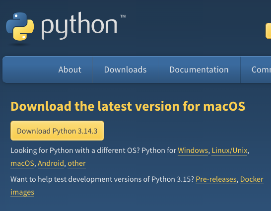
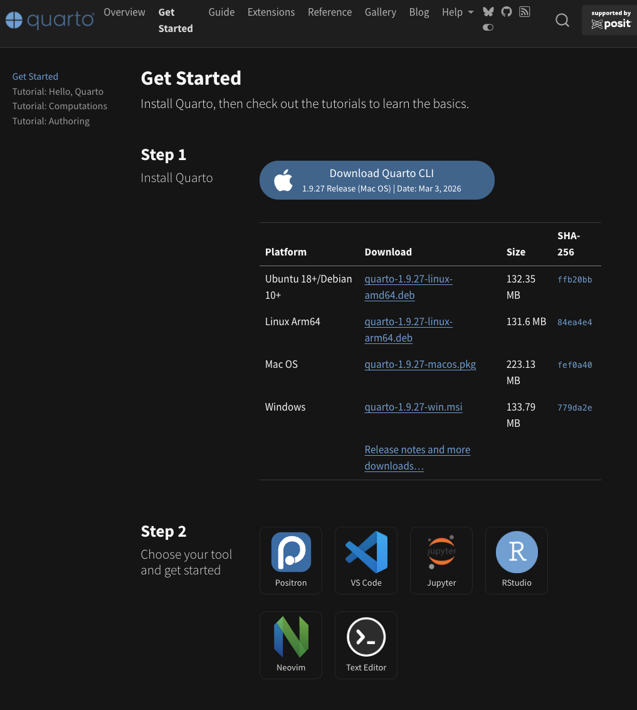
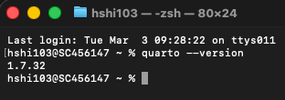
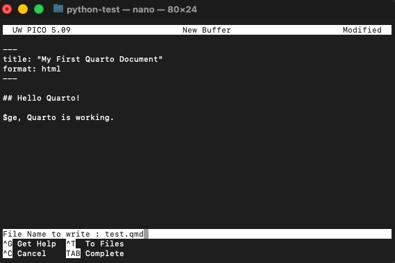
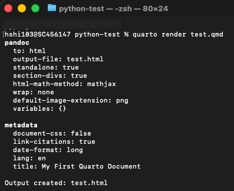

# 1.1 Installation {.unnumbered}

## Story problem

**The first successful GIS import**

You want to:

- Import GeoPandas without mysterious errors
- Run a terminal command that proves everything is working
- Keep the setup steps short and repeatable
- Have the same environment as your classmates

## What you will learn

- Install Python 3.1X and verify it works
- Install a modern code editor (Positron or VS Code)
- Install Quarto for creating beautiful reports and documents
- Install `uv` package manager
- Verify your GIS stack imports correctly

---

## Prerequisites checklist

Before you begin, ensure you have:

- [ ] Administrator access to your computer
- [ ] A stable internet connection
- [ ] At least 2GB of free disk space
- [ ] macOS 10.15+ or Windows 10+

---

## Step 1: Install Python 3.1X

### Why You Should Use the Latest Python Version? 


* Better Performance: Newer versions (e.g., 3.11+) are significantly faster than older ones.
* New Features & Syntax: Latest versions provide cleaner syntax, such as structural pattern matching and improved error messages.
* Security Updates: Only the latest versions receive security patches, protecting your code from vulnerabilities.
* Library Support: Modern libraries and frameworks often require newer versions to function correctly. 

Using the latest version allows your projects are faster, safer, and easier to maintain.


### Installation: macOS

**Option 1: Official installer (recommended for beginners)**

This is the simplest approach. You'll download an installer that works just like installing any other app on your Mac.

1. Open your web browser and go to [python.org/downloads](https://www.python.org/downloads/)
2. Look for the button that says **Python 3.12.x** (the `x` will be whatever the latest patch number is---that's fine, any 3.12 version works)
3. Click it to download a `.pkg` file
4. Once it finishes downloading, open the `.pkg` file from your Downloads folder
5. The installer wizard will walk you through the process---just keep clicking "Continue" and then "Install"




::: {.callout-warning title="Pick ONE method---do not mix!"}

Install Python using **either** the official installer **or** Homebrew, but **not both**. If you install Python from the website and then also install it via Homebrew, you'll end up with two separate copies of Python on your machine. Your terminal won't know which one to use, your packages will get installed into the wrong copy, and you'll spend hours debugging "module not found" errors that have nothing to do with your actual code.

If you're not sure what Homebrew is, just use the official installer above and move on---you'll be fine.

If you *do* already have Homebrew and prefer using it:

```bash
brew install python
```
:::


### Installation: Windows

1. Open your web browser and go to [python.org/downloads](https://www.python.org/downloads/)
2. Download **Python 3.12.x** for Windows (64-bit)
3. Find the downloaded file and double-click to run the installer
4. **This next step is critical---don't skip it!** At the very bottom of the first installer screen, you'll see a checkbox that says **"Add Python to PATH"**. Make sure you tick that box before doing anything else.
5. Now click "Install Now" and let it finish

::: {.callout-warning}
**Why does "Add Python to PATH" matter?** PATH is how your computer knows where to find programs when you type commands in the terminal. Without it, your computer won't know where Python lives, and every command you try will fail with a "not found" error. If you accidentally skipped this step, the easiest fix is to uninstall Python completely and reinstall it with the checkbox ticked.

If you need a step-by-step guide, follow the [YouTube Link](https://www.youtube.com/watch?v=AOQX6LZUaGo&t=13s)

:::

### Verify Python installation

Great---Python should now be on your machine! Let's make sure it actually works. To do that, we need to open a **terminal** (also called a command line). If you've never used one before, don't worry---it's just a text-based way to talk to your computer.

**How to open your terminal:**

- **macOS**: Open Finder, go to Applications → Utilities, and double-click on **Terminal**. Alternatively, press `Cmd + Space` to open Spotlight, type "Terminal", and hit Enter.
- **Windows**: Press the Windows key on your keyboard, type **"PowerShell"**, and press Enter.

You should see a window with a blinking cursor waiting for you to type something. That's your terminal!

Now type the following command and press Enter:

::: {.panel-tabset}

## macOS
```bash
python3 --version
```

You should see something like:
```
Python 3.12.x
```

## Windows
```powershell
python --version
```

You should see something like:
```
Python 3.12.x
```

:::

If you see a version number starting with `3.12`, congratulations---Python is installed and working!

::: {.callout-tip}
**A small but important difference:** On macOS, you need to type `python3` (with the `3`), because older Macs sometimes have an ancient version of Python 2 pre-installed, and just typing `python` might accidentally use that one. On Windows, `python` is fine.
:::

---

## Step 2: Install a code editor

A code editor is where you'll actually write your Python scripts. Think of it as Microsoft Word, but designed for writing code---it highlights your syntax in different colours, catches typos, and helps you run your programs. Here are two great options.

### Option 1: Positron (recommended for data science)

Positron is a newer editor built specifically for people doing data analysis and science. It feels familiar if you've used RStudio before, and it works beautifully with Python, R, and Quarto (which we'll install shortly).

1. Go to [positron.posit.co](https://positron.posit.co/)
2. Click the download button for your operating system (macOS or Windows)
3. Install it the same way you'd install any app---open the downloaded file and follow the prompts


### Option 2: VS Code (industry standard)

VS Code (Visual Studio Code) is the most widely used code editor in the world. It's free, fast, and has thousands of extensions. If you're thinking about a career in tech, learning VS Code is a valuable skill.

1. Go to [code.visualstudio.com](https://code.visualstudio.com/)
2. Download it for your operating system
3. Install it by opening the downloaded file and following the prompts
4. Once VS Code is open, you'll want to install the **Python extension** so it understands Python code:
   - Look for the square icon on the left sidebar (or press `Ctrl+Shift+X` on Windows / `Cmd+Shift+X` on Mac)
   - In the search bar that appears, type "Python"
   - Click **Install** on the one made by Microsoft (it'll be the first result)

::: {.callout-note title="VS Code download page"}

:::

---

## Step 2a: A text editor for quick edits

It's also handy to have a lightweight text editor on your computer---something you can open quickly to peek at a file or make a small edit without launching your full code editor. Think of it as the difference between opening a full word processor versus a quick notepad.

I recommend [Sublime Text](https://www.sublimetext.com/)---it opens instantly, handles large files without breaking a sweat, and has a clean interface.


---

## Step 3: Install Quarto

### What is Quarto and why do we need it?

Quarto is a publishing tool that lets you combine your Python code, its output (tables, maps, charts), and your written analysis into a single, polished document. Instead of writing code in one place, copying charts into Word, and formatting everything separately, Quarto does it all at once. You write one file, hit render, and out comes a beautiful HTML page, PDF, or Word document.

In this course, you'll use Quarto for your assignments and lab reports. It's how you'll present your GIS analysis in a professional, reproducible way.

### Installation

Quarto has a straightforward installer for both macOS and Windows.

1. Go to [quarto.org/docs/get-started](https://quarto.org/docs/get-started/)
2. You'll see download buttons for different operating systems. Click the one that matches yours.



::: {.panel-tabset}

## macOS

3. Download the `.pkg` file
4. Open it from your Downloads folder
5. The installer will guide you through the process---just keep clicking "Continue" and then "Install", the same way you installed Python

## Windows

3. Download the `.exe` installer
4. Double-click the downloaded file to run it
5. Follow the installation wizard---click "Next" through each step and then "Install"

:::

### Verify Quarto installation

Just like we did with Python, let's make sure Quarto installed correctly. Open your terminal again and type:

```bash
quarto --version
```

You should see a version number like:
```
1.7.x
```




If you see a version number, you're all set! 

If you get a "command not found" error, try closing your terminal and opening a new one---sometimes the terminal needs a fresh start to recognise newly installed programs.

### Quick test: Render a document

Let's do a quick sanity check to make sure Quarto can actually render something. Don't worry about understanding every detail here---we just want to confirm it works.

1. Open your code editor (Positron or VS Code)
2. Create a new file and paste the following content:

```{.markdown filename="test.qmd"}
---
title: "My First Quarto Document"
format: html
---

## Hello Quarto!

This is a test document. If you can see this as a nicely formatted HTML page, Quarto is working.
```

Sorry guys, I did it through the old fashion way using the nano editor embedded in the terminal!




<br>

3. Save the file as `test.qmd` somewhere easy to find (like your Desktop or Documents folder)
4. Go back to your terminal, navigate to where you saved the file, and run:

```bash
quarto render test.qmd
```



If a web browser pops open showing a nicely formatted page with "My First Quarto Document" as the title, everything is working perfectly. You can delete this test file afterwards.

::: {.callout-tip}
**Positron users**: Positron has built-in Quarto support, so you can also render documents directly from the editor using the "Render" button at the top of `.qmd` files. Very convenient!
:::

---

## Step 4: Install `uv` package manager

### Why `uv` instead of `pip`?

If you've seen any Python tutorials online, they probably told you to install packages with `pip install something`. That works, but it has some real drawbacks that become painful as your projects grow:

- **It's slow.** Installing a big package like GeoPandas with all its dependencies can take minutes with `pip`, and you'll be staring at your screen wondering if it's stuck.
- **Dependency conflicts.** Different packages sometimes need different versions of the same library. `pip` isn't great at figuring this out, and you can end up with broken environments.
- **Not reproducible.** Running `pip install pandas` today might install a different version than running it next month. This means your classmate's code might not work on your machine, even if you installed the "same" packages.

`uv` is a modern replacement that fixes all of these problems. It's written in Rust (a very fast programming language), and it's typically **10 to 100 times faster** than `pip`. It also handles dependency conflicts properly and creates lock files so everyone gets exactly the same package versions.

**To give you a sense of the speed difference:** installing the `transformers` library and all its dependencies takes about 50 seconds with `pip`, but only about 1.8 seconds with `uv`.

### Installation: macOS

The simplest way to install `uv` on a Mac is with the standalone installer. Open your terminal and paste this command:

```bash
curl -LsSf https://astral.sh/uv/install.sh | sh
```

This downloads and runs the official install script. When it finishes, close your terminal and open a new one so the changes take effect.

::: {.callout-tip}
**Alternative methods** (if you prefer):

Using pip:
```bash
pip install uv
```

Using Homebrew:
```bash
brew install uv
```
:::

### Installation: Windows

Open PowerShell and paste this command:

```powershell
powershell -ExecutionPolicy ByPass -c "irm https://astral.sh/uv/install.ps1 | iex"
```

This runs the official Windows installer for `uv`. Once it finishes, close PowerShell and open a new one.

::: {.callout-tip}
**Alternative method**: You can also install via pip:
```powershell
pip install uv
```
:::

### Verify `uv` installation

Open a fresh terminal window and type:

```bash
uv --version
```


If you see a version number, `uv` is ready to go!

---

## You're all set!

If all four tools are installed and verified---Python, a code editor, Quarto, and `uv`---you've got everything you need to start working with geospatial Python. That's a lot of installing, and you've done great getting through it.

**Next step**: Head to Section 1.2 to learn how to manage projects with `uv` environments. That's where things start getting interesting---you'll create your first project and import GeoPandas for the first time.


