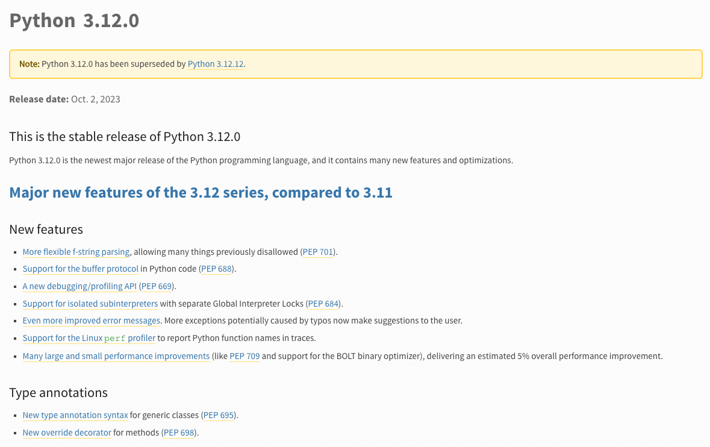
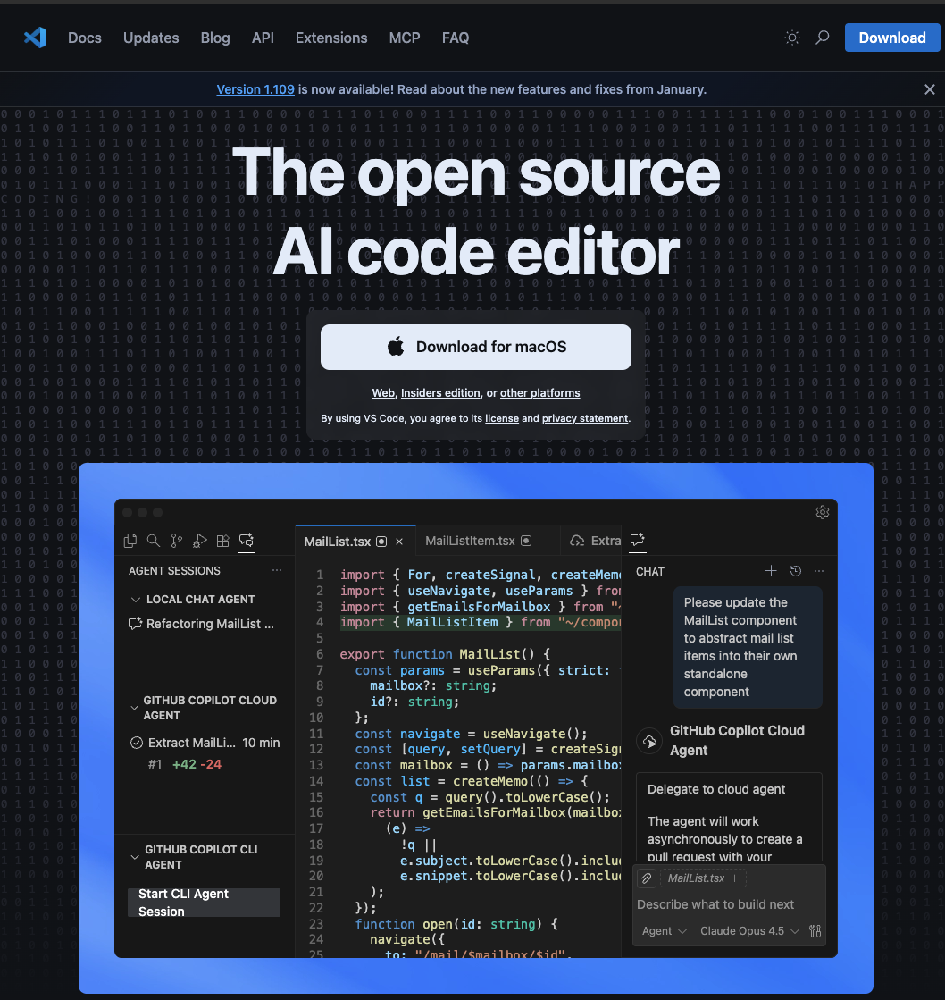
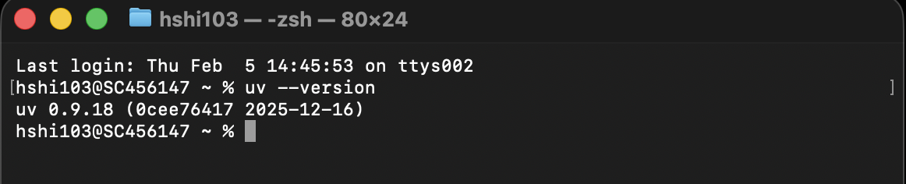

# 1.1 Installation {.unnumbered}

## Story problem

**The first successful GIS import**

You want to:
- Import GeoPandas without mysterious errors
- Run a terminal command that proves everything is working
- Keep the setup steps short and repeatable
- Have the same environment as your classmates

## What you will learn

- Install Python 3.12 and verify it works
- Install a modern code editor (Positron or VS Code)
- Install `uv` package manager
- Verify your GIS stack imports correctly

---

## Prerequisites checklist

Before you begin, ensure you have:

- [ ] Administrator access to your computer
- [ ] A stable internet connection
- [ ] At least 2GB of free disk space
- [ ] macOS 10.15+ or Windows 10+

---

## Step 1: Install Python 3.12

### Why Python 3.12? (H's subjective opinion)



Python 3.12 offers:
- Improved performance (up to 25% faster)
- Better error messages
- Full compatibility with modern GIS packages
- Long-term support

### Installation: macOS

**Option 1: Official installer (recommended for beginners)**

1. Visit [python.org/downloads](https://www.python.org/downloads/)
2. Download **Python 3.12.x** for macOS
3. Open the downloaded `.pkg` file
4. Follow the installation wizard


If you have Homebrew installed:

```bash
brew install python@3.12
```

### Installation: Windows

1. Visit [python.org/downloads](https://www.python.org/downloads/)
2. Download **Python 3.12.x** for Windows (64-bit)
3. Run the installer
4. **CRITICAL**: ✅ Check "Add Python to PATH"
5. Click "Install Now"


::: {.callout-warning}
If you forget to check "Add Python to PATH", you'll need to uninstall and reinstall Python.
:::

### Verify Python installation

Open your terminal:

**macOS**: Applications → Utilities → Terminal  
**Windows**: Press Windows key, type "PowerShell", press Enter

::: {.callout-note title="Screenshot placeholder"}
**[SCREENSHOT NEEDED: macOS Terminal application]**
:::

::: {.callout-note title="Screenshot placeholder"}
**[SCREENSHOT NEEDED: Windows PowerShell window]**
:::

Run the following command:

::: {.panel-tabset}

## macOS
```bash
python3 --version
```

Expected output:
```
Python 3.12.x
```

## Windows
```powershell
python --version
```

Expected output:
```
Python 3.12.x
```

:::

::: {.callout-tip}
On macOS, always use `python3` (not `python`) to ensure you're using Python 3.
On Windows, you can use `python`.
:::

---

## Step 2: Install a code editor

You need a code editor to write Python scripts. We recommend either:

### Option 1: Positron (recommended for data science)

Positron is a new IDE specifically designed for data science and works excellently with Python, R, and Quarto.

1. Visit [positron.posit.co](https://positron.posit.co/)
2. Download for your operating system
3. Install using the standard installer


### Option 2: VS Code (industry standard)

VS Code is widely used and has excellent Python support.

1. Visit [code.visualstudio.com](https://code.visualstudio.com/)
2. Download for your operating system
3. Install using the standard installer
4. After opening VS Code, install the **Python extension**:
   - Click Extensions icon (or press Ctrl+Shift+X / Cmd+Shift+X)
   - Search for "Python"
   - Install the Microsoft Python extension

::: {.callout-note title="VS Code download page"}

:::

---

## Step 2a: Text Editor

Getting a good text editor as your buddy is always handy. 
It's because you might be caught into a situation to write necessary codes and annonations where CLI is not made possible.

For this course, I highly recommend you download Sublime text (https://www.sublimetext.com/)


---


## Step 3: Install `uv` package manager

### Why `uv` instead of `pip`?

Traditional Python used `pip` for package management, but it has limitations:

- **Slow**: Installing complex packages can take minutes
- **Dependency conflicts**: Different packages might require incompatible versions
- **Not reproducible**: `pip install pandas` might install different versions on different days

`uv` solves these problems:

- **Fast**: Written in Rust, 10-100x faster than pip
- **Reliable**: Better dependency resolution
- **Reproducible**: Lock files ensure everyone gets the same versions

**Performance comparison** (installing transformers library + dependencies):
- `pip`: ~50 seconds
- `uv`: ~1.8 seconds

### Installation: macOS

**Option 1: pip (recommended)**

```bash
pip install uv
```

**Option 2: Standalone installer**

```bash
curl -LsSf https://astral.sh/uv/install.sh | sh
```

**Option 3: Using brew**

```bash
brew install uv
```

### Installation: Windows

**Option 1: Standalone installer (recommended)**

Open PowerShell and run:

```powershell
powershell -ExecutionPolicy ByPass -c "irm https://astral.sh/uv/install.ps1 | iex"
```


**Option 2: Using pip**

```powershell
pip install uv
```

### Verify `uv` installation

In your terminal:

```bash
uv --version
```



---

If all three commands show version numbers, you're ready to proceed! 🎉


---

## Summary

You should now have:

- [x] Python 3.12 installed and verified
- [x] A code editor (Positron or VS Code)

**Next step**: Learn how to manage projects with `uv` environments (Section 1.2).

<iframe width="560" height="315" src="https://youtu.be/8zggSBvTQbM" frameborder="0" allowfullscreen></iframe>

