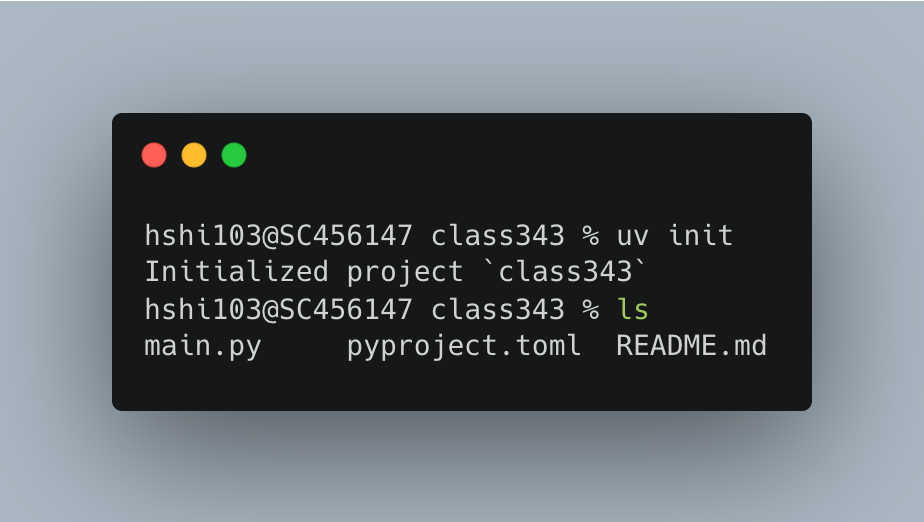
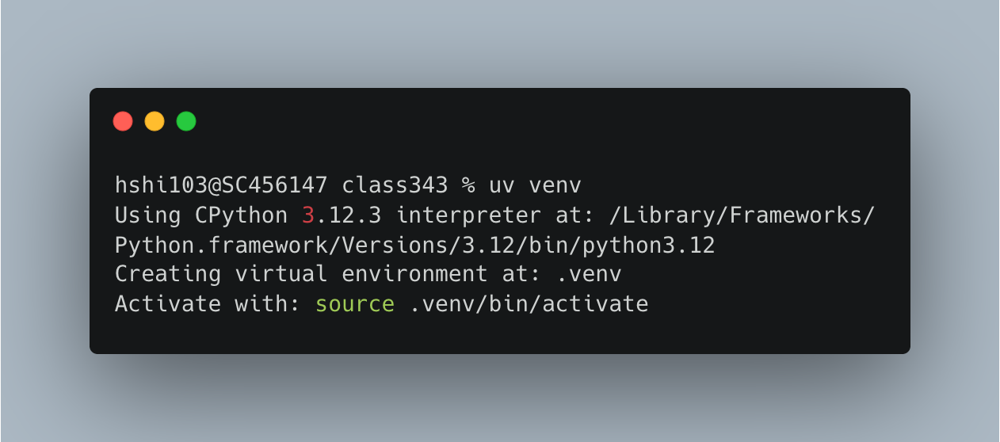
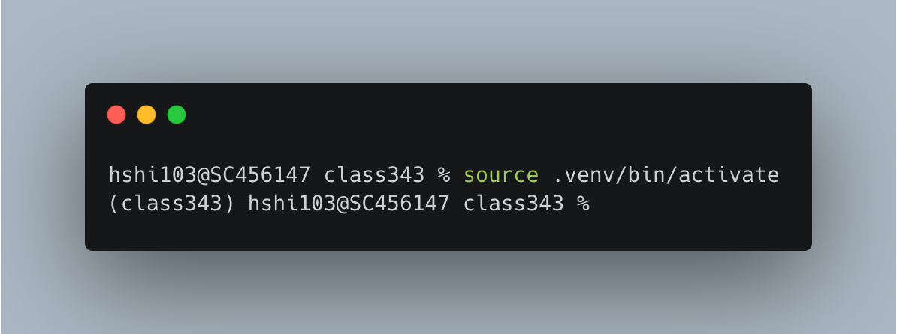
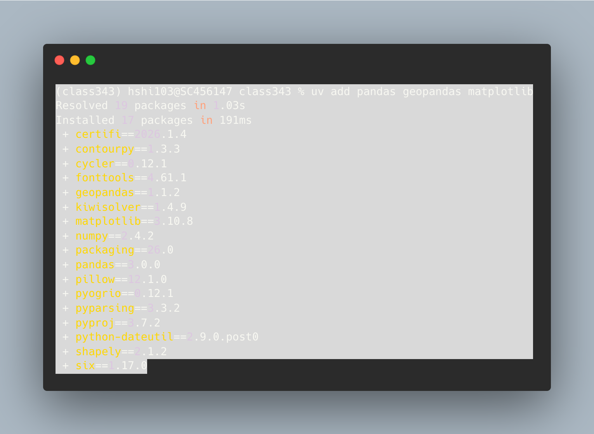
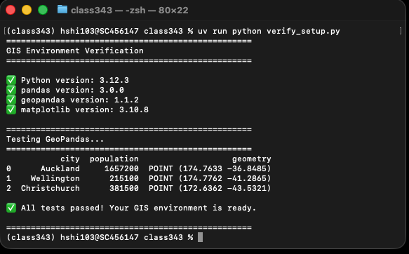

# 1.2 UV environments {.unnumbered}

## Story problem

You've built a Python script that analyses bus routes in Auckland. Your supervisor wants to run it, but:

- They use Windows, you use macOS
- They have different versions of packages installed globally
- When they run your code, it crashes with import errors

**Solution**: Virtual environments ensure your project works anywhere, anytime.

## What you will learn

- Understand why virtual environments matter
- Create and manage environments with `uv`
- Add packages and lock versions for reproducibility
- Run scripts consistently with `uv run`
- Share projects that "just work"

---

## Understanding virtual environments

### The problem: Global installations

Imagine this scenario:

```
Your computer (global Python):
├── pandas 2.0.0
├── geopandas 0.14.0
└── numpy 1.24.0

Project A needs:        Project B needs:
├── pandas 2.0.0       ├── pandas 1.5.0  ❌ Conflict!
├── geopandas 0.14.0   ├── geopandas 0.12.0
└── numpy 1.24.0       └── numpy 1.23.0
```

**Problem**: You can't have two versions of pandas installed globally!

### The solution: Virtual environments

Each project gets its own isolated environment:

```
Your computer:
├── Project A/
│   └── .venv/           ← Isolated environment
│       ├── pandas 2.0.0
│       ├── geopandas 0.14.0
│       └── numpy 1.24.0
└── Project B/
    └── .venv/           ← Separate isolated environment
        ├── pandas 1.5.0
        ├── geopandas 0.12.0
        └── numpy 1.23.0
```

**Benefits**:
- No conflicts between projects
- Each project has exactly what it needs
- Easy to share and reproduce

---

## Key `uv` commands

| Command | Purpose |
|---------|---------|
| `uv init` | Create a new project |
| `uv venv` | Create virtual environment |
| `uv add <package>` | Install a package |
| `uv remove <package>` | Uninstall a package |
| `uv sync` | Install all locked dependencies |
| `uv run <command>` | Run command in environment |
| `uv pip list` | List installed packages |
| `uv lock` | Update lock file |

---

## Creating your first project

### Step 1: Create project directory

## macOS
```bash
cd ~/Documents
mkdir class343
cd class343
```

## Windows
```powershell
cd ~\Documents
mkdir class343
cd class343
```

:::

### Step 2: Initialise with `uv`

```bash
uv init
```

This creates:
- `pyproject.toml` - project configuration file
- `main.py` - sample Python script
- `README.md` - Documentation
- `.python-version` - specifies Python version




### Step 3: Examine `pyproject.toml`

Open `pyproject.toml` in your editor:

```toml
[project]
name = "class343"
version = "0.1.0"
description = "Add your description here"
readme = "README.md"
requires-python = ">=3.12"
dependencies = []

```

This file tracks:
- Project metadata
- Python version requirement
- Dependencies (currently empty)

### Step 4: Create virtual environment

```bash
uv venv
```


Output:
```
Using Python 3.12.x
Creating virtual environment at: .venv
Activate with: source .venv/bin/activate (Linux/macOS) or .venv\Scripts\activate (Windows)
```



The `.venv` folder contains:

```
.venv/
├── bin/ (macOS) or Scripts/ (Windows)  ← Python executables
├── lib/                                 ← Installed packages
└── pyvenv.cfg                          ← Configuration
```

::: {.callout-tip}
The `.venv` folder can be large (100MB+). You'll add it to `.gitignore` later so it's not tracked in Git.

We will do this later when we learn git!
:::



To see the list structure of the code, hit:

```
find . -maxdepth 2 -print
```

---

## Adding packages

### Install your first package

Let's install pandas:

```bash
uv add pandas
```

Watch what happens:

1. `uv` downloads pandas and its dependencies
2. Updates `pyproject.toml`
3. Creates/updates `uv.lock`


Now check `pyproject.toml`:

```toml
[project]
name = "auckland-greenspaces"
version = "0.1.0"
description = "Add your description here"
readme = "README.md"
requires-python = ">=3.12"
dependencies = [
    "pandas>=2.2.3",  # ← Added automatically!
]
```

### Install multiple packages

Install all GIS packages you need:

```bash
uv add geopandas matplotlib
```

Watch as `uv` quickly installs each package and its dependencies!




Each `uv add` command:
- Installs the package
- Resolves dependencies
- Updates `pyproject.toml`
- Updates `uv.lock`

### Understanding `uv.lock`

Open `uv.lock` - it's long! It contains:

```toml
[[package]]
name = "pandas"
version = "2.2.3"
source = { registry = "https://pypi.org/simple" }
dependencies = [
    { name = "numpy" },
    { name = "python-dateutil" },
    { name = "pytz" },
]
...
```

**Purpose**: This file locks *exact* versions of every package and dependency.

**Result**: Anyone who runs `uv sync` gets **identical** package versions.

::: {.callout-important}
**Always commit `uv.lock` to Git!** This ensures reproducibility.
:::


---

## Running code in your environment

### Quick test

Run this one-liner to check if GeoPandas imports correctly:

```bash
uv run python -c "import geopandas as gpd; print('✅ GeoPandas', gpd.__version__)"
```

Expected output:
```
✅ GeoPandas 1.1.x
```

### Comprehensive test

Create a test script called `verify_setup.py`:

```python
"""
Verification script for GIS environment setup
University of Auckland - GISCI 343
"""

import sys
import pandas as pd
import geopandas as gpd
import matplotlib.pyplot as plt
from shapely.geometry import Point

print("=" * 50)
print("GIS Environment Verification")
print("=" * 50)

# Check Python version
print(f"\n✅ Python version: {sys.version.split()[0]}")

# Check package versions
print(f"✅ pandas version: {pd.__version__}")
print(f"✅ geopandas version: {gpd.__version__}")
print(f"✅ matplotlib version: {plt.matplotlib.__version__}")

# Test GeoPandas functionality
print("\n" + "=" * 50)
print("Testing GeoPandas...")
print("=" * 50)

# Create a sample GeoDataFrame with Auckland and Wellington
cities = gpd.GeoDataFrame({
    'city': ['Auckland', 'Wellington', 'Christchurch'],
    'population': [1657200, 215100, 381500],
    'geometry': [
        Point(174.7633, -36.8485),  # Auckland
        Point(174.7762, -41.2865),  # Wellington
        Point(172.6362, -43.5321)   # Christchurch
    ]
}, crs='EPSG:4326')

print(cities)

print("\n✅ All tests passed! Your GIS environment is ready.")
print("\n" + "=" * 50)
```

Run the verification script:

```bash
uv run python verify_setup.py
```



Expected output should show:
- Python 3.12.x
- Package versions
- A table with three New Zealand cities
- "All tests passed!" message


::: {.callout-tip}
**Recommendation**: Use `uv run` instead of manual activation. It's simpler and less error-prone.
:::

---

## Managing dependencies

### View installed packages

```bash
uv pip list
```

Output:
```
Package      Version
------------ -------
pandas       2.2.3
numpy        1.26.4
geopandas    1.1.2
...
```


### Remove a package

```bash
uv remove folium
```

This:
- Uninstalls folium
- Removes it from `pyproject.toml`
- Updates `uv.lock`

### Upgrade packages

To upgrade all packages to latest compatible versions:

```bash
uv lock --upgrade
uv sync
```

::: {.callout-warning}
Be cautious with upgrades! Test your code after upgrading packages.
:::


---

## Quick reference

```bash
# Create project
uv init
uv venv

# Add packages
uv add pandas geopandas matplotlib

# Run code
uv run python script.py

# Recreate environment (new machine)
uv venv
uv sync

# View packages
uv pip list

# Update packages
uv lock --upgrade
uv sync

# Remove package
uv remove package-name
```
