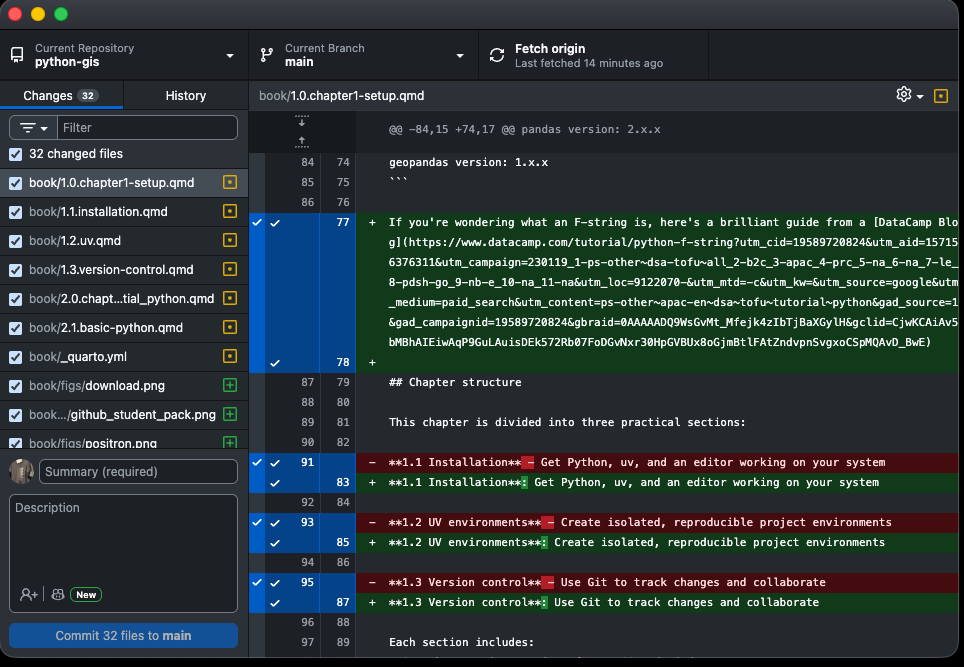

# 1.3 Version control with Git {.unnumbered}

## Story problem

**Why did my analysis change?**

You're working on your class343 GIS project. You run your script on Monday and get one result. On Friday, you run the same script and the results are completely different.

**Questions arise**:
- What changed between Monday and Friday?
- Which version was correct?
- Can you go back to Monday's version?
- How can you share your work with classmates without confusion?

**Answer**: Git tracks every change automatically, like having unlimited "undo" for your entire project.

## What you will learn

- Understand what Git and GitHub are
- Sign up for GitHub (essential for students!)
- Install and use GitHub Desktop
- Track changes in your class343 project
- Share your work on GitHub
- Collaborate safely with version control

---

## Understanding version control

### The problem: Manual version control

If you've ever worked on an essay or a report, you've probably done something like this at some point---saved multiple copies of the same file with increasingly desperate names:

```
class343/
├── analysis.py
├── analysis_v2.py
├── analysis_v3.py
├── analysis_final.py
├── analysis_final_REALLY.py
└── analysis_final_2024-02-07.py
```

We've all been there. But this approach falls apart quickly. Which file is actually the latest? What did you change between v2 and v3? If something breaks in the "final" version, how do you get back to the one that was working?

### The solution: Git + GitHub

Git is a tool that keeps track of every change you make to your files, automatically. Instead of saving multiple copies, you keep just one file, and Git remembers the entire history behind it:

```
class343/
└── analysis.py  ← One file, entire history tracked

Git history:
├── Monday 9am:    "Initial analysis"
├── Tuesday 2pm:   "Fixed bug in coordinates"
├── Thursday 10am: "Added visualisation"
└── Friday 4pm:    "Final report version"
```

You can jump back to any of those points in time whenever you want. It's like having a time machine for your code. And when you combine Git with GitHub (a website that stores your code online), you also get a backup of your work, an easy way to share with classmates, and---as a bonus---a portfolio that future employers can see.

---

## What are Git and GitHub?

These two things sound similar but they do different jobs, and it's worth understanding the difference.

### Git

Git is a program that runs on your computer. It watches your project folder and keeps a detailed log of every change you save. It works entirely offline---you don't need an internet connection to track your changes. Think of it as a personal diary for your project.

### GitHub

GitHub is a website ([github.com](https://github.com)) where you can upload your Git-tracked projects. It's like Google Drive or Dropbox, but specifically designed for code. Other people can see your projects, download them, and even suggest improvements. For students, it doubles as a portfolio---a place where you can show potential employers what you've built.

### How they work together

Here's the relationship in a nutshell:

```
Your computer          │          GitHub.com
                       │
class343/              │          Your GitHub profile
├── .git/    ←────────┼────────→  class343 repository
├── analysis.py        │          (visible to others)
└── data/              │
```

You do your work on your computer using Git to track changes. When you're ready, you "push" those changes up to GitHub so they're backed up online and shareable. You can think of it as saving a local draft versus publishing it.

---

## Step 1: Create a GitHub account

Let's start by getting you set up on GitHub.

### Sign up

1. Go to [github.com/signup](https://github.com/signup)
2. When it asks for your email, use your **University of Auckland email**---this is important because it unlocks free student benefits (more on that in a moment)
3. Pick a **professional username**. This will be visible to anyone who looks at your profile, including future employers, so choose something sensible like `hshin-uoa` rather than `xXCoolGuy420Xx`
4. Check your inbox and verify your email address

::: {.callout-tip title="Why use your university email?"}
Using your university email lets you apply for the [GitHub Student Developer Pack](https://education.github.com/pack), which gives you free access to a bunch of premium tools (including GitHub Copilot, an AI coding assistant). It's worth over $200,000 in free software, and all you need is a student email to get it.
:::

### Apply for the Student Developer Pack

This only takes a minute and it's completely free:

1. Go to [education.github.com/pack](https://education.github.com/pack)
2. Click "Sign up for Student Developer Pack"
3. Follow the steps to verify you're a student (you might need to upload a photo of your student ID)
4. Once approved, you'll have access to all the premium tools


---

## Step 2: Install GitHub Desktop

### Why GitHub Desktop?

Git is normally used through the terminal with typed commands, which can feel intimidating when you're just starting out. GitHub Desktop is a visual app that puts a friendly interface on top of Git. You can see your changes, write descriptions of what you did, and upload everything to GitHub---all with buttons and clicks instead of memorising commands.

For this course, we'll use GitHub Desktop so you can focus on learning GIS rather than wrestling with terminal commands.

### Download and install

::: {.panel-tabset}

## macOS

1. Go to [desktop.github.com](https://desktop.github.com)
2. Click the download button for macOS
3. Open the downloaded `.zip` file
4. Drag the GitHub Desktop app into your Applications folder
5. Open GitHub Desktop from your Applications folder

## Windows

1. Go to [desktop.github.com](https://desktop.github.com)
2. Click the download button for Windows
3. Run the installer (`GitHubDesktopSetup.exe`)
4. Wait for the installation to finish---it should only take a minute
5. GitHub Desktop will open automatically when it's done

:::

### Sign in to GitHub Desktop

When GitHub Desktop opens for the first time, it'll ask you to connect it to your GitHub account:

1. Click **"Sign in to GitHub.com"**
2. Your web browser will open and ask you to authorise GitHub Desktop
3. Click **Authorise** and then switch back to the GitHub Desktop app

This links your computer to your online GitHub account, so when you push changes later, GitHub knows who you are.

### Configure your identity

GitHub Desktop will also ask for your **name** and **email**. These get attached to every change you save (called a "commit"), so your classmates and future self can see who made each change and when. Use the same email you signed up with.

---

## Step 3: Turn class343 into a Git repository

Now let's connect your class343 project (the one you created in Section 1.2) to Git so it starts tracking your changes.

### Add your project to GitHub Desktop

1. Open GitHub Desktop
2. Click **File → Add Local Repository**
3. Navigate to your `class343` folder (it should be in `Documents/class343`)
4. Click **Choose**

You'll probably see a message saying **"This directory does not appear to be a Git repository."** That's completely expected---we haven't set it up as one yet! Click **"Create a repository"** to continue.

### Create the repository

A dialog box will pop up asking you to fill in some details:

1. **Name**: This should already say `class343`
2. **Description**: Type something like "GISCI 343 coursework and projects"
3. **Local path**: Should already point to your Documents folder
4. ✅ **Initialise this repository with a README** --- tick this box
5. **Git ignore**: Click the dropdown and select **Python** (this tells Git to automatically ignore files like `.venv` and `__pycache__` that shouldn't be tracked)
6. **License**: Leave as None for now

Click **Create Repository**.

::: {.callout-important title="What just happened?"}
Behind the scenes, GitHub Desktop just did several things for you:

- Created a hidden `.git` folder inside your project---this is where Git stores its history
- Created a `.gitignore` file that tells Git to skip your `.venv` folder and Python cache files (remember, we said `.venv` shouldn't be tracked?)
- Created a `README.md` file
- Made your very first "commit" (a saved snapshot), called "Initial commit"
:::

---

## Step 4: Understanding the GitHub Desktop interface

Take a moment to look around the GitHub Desktop window. There's a lot here, but it's all quite logical once you know what each piece does.



**Left panel --- Changes:** This shows a list of files you've modified since your last commit. You'll see little coloured icons next to each file: a green `+` means it's a brand-new file, a yellow dot means it's been modified, and a red `-` means it's been deleted.

**Centre panel --- Diff view:** When you click on a file in the left panel, this area shows you exactly what changed. Lines highlighted in green are things you added; lines in red are things you removed. This is incredibly useful for reviewing your work before saving it.

**Bottom left --- Commit box:** This is where you describe what you changed and save it. You'll write a short summary, optionally add a longer description, and then click the "Commit to main" button.

**Top bar:** Shows which repository you're working on, which branch you're on (usually "main"), and has buttons to sync your changes with GitHub.

---

## Step 5: Making your first commit

Let's put this into practice. We'll make a small change to a file and then "commit" it---which just means saving a snapshot of that change in Git's history.

### Make a change

1. Open your `class343` folder in your code editor
2. Open the `hello.py` file (or `main.py`, whichever was created by `uv init`)
3. Add a comment at the top so it looks something like this:

```python
# GISCI 343 - Introduction to GIS Programming
# Author: Your Name
# Date: 2024-02-07

def main():
    print("Hello from Python!")
```

4. Save the file

### See the change in GitHub Desktop

Now switch back to GitHub Desktop. You should see something new:

1. In the left panel, the file you edited appears with a yellow dot (modified)
2. Click on it, and the centre panel will show your changes---the lines you added will be highlighted in green

This is the "diff" view. It's a quick way to double-check what you're about to commit before you save it.

### Commit the change

Look at the bottom-left corner of GitHub Desktop:

1. In the **Summary** field, type a short description: `Add author information to hello.py`
2. In the **Description** field (optional), you could add: "Added header comment with course info"
3. Click **Commit to main**

That's it---you've made your first commit! Your change is now permanently recorded in Git's history. Even if you edit the file again later, you can always come back to this exact version.

::: {.callout-tip title="Writing good commit messages"}
Your commit messages are notes to your future self (and anyone else reading your project). Write them as if you'll need to understand what you did six months from now, because you will.

**Good messages** (specific and clear):

- ✅ "Add author information to hello.py"
- ✅ "Fix bug in coordinate transformation"
- ✅ "Add Auckland parks dataset"

**Bad messages** (vague and unhelpful):

- ❌ "Update"
- ❌ "Changes"
- ❌ "Fixed stuff"
:::

---

## Step 6: Viewing your history

Click the **History** tab near the top-left of GitHub Desktop.

You'll see a list of all the commits you've made so far. Right now there should be two:

1. **Initial commit** --- the one GitHub Desktop created when you set up the repository
2. **Add author information to hello.py** --- the one you just made

Click on any commit to see exactly what changed in that snapshot: when it was made, who made it, and which lines were added or removed. This is your time machine---as your project grows over the semester, this history becomes incredibly valuable for understanding how your work evolved.

---

## Step 7: Publishing to GitHub

So far, everything has been happening locally on your computer. Let's upload your project to GitHub so it's backed up online and you can share it with others.

### Publish your repository

1. Look for the **Publish repository** button in the top-right area of GitHub Desktop


2. A dialog will appear. Fill it in:
   - **Name**: `class343`
   - **Description**: "GISCI 343 coursework and projects"
   - ❌ **Keep this code private** --- uncheck this box if you want your project to be publicly visible (useful for building a portfolio)
3. Click **Publish Repository**

That's it---your project is now live on GitHub!

### See it online

To view your project on GitHub's website:

1. In GitHub Desktop, click **Repository → View on GitHub**


Your browser will open to your repository page, where you can see all your files, your README, and your commit history. The URL of this page is what you'd share with classmates, supervisors, or future employers.

---

## Step 8: The daily workflow

Now that everything is set up, here's the routine you'll follow every time you work on your project. It becomes second nature after a few days.

### 1. Work on your project

Just do your thing---write Python scripts, add data files, create notebooks, update your notes. Work in your code editor the way you normally would.

### 2. Review your changes in GitHub Desktop

When you've finished a chunk of work (or you're wrapping up for the day), open GitHub Desktop. The left panel will show you every file that changed. Click through them and review the diffs in the centre panel to make sure everything looks right.

### 3. Commit your changes

Write a clear summary of what you did, and click **Commit to main**. Think of this as saving a "checkpoint" that you can always come back to.

### 4. Push to GitHub

After committing, click **Push origin** in the top-right area. This uploads your latest commits to GitHub, so your work is backed up online.

::: {.callout-tip title="When should you commit?"}
Commit whenever you've finished a logical piece of work. Some good moments to commit:

- ✅ After fixing a bug
- ✅ After adding a new feature or function
- ✅ After finishing a step in your analysis
- ✅ At the end of a work session (even if things aren't perfect)

Avoid committing:

- ❌ Every single line you type (too granular)
- ❌ Code that's completely broken and won't run
- ❌ **Sensitive information like passwords or API keys** (once it's in Git history, it's very hard to remove)
:::

Over time, your GitHub profile will build up a contributions chart---a green "waffle plot" that shows how active you've been. It's oddly satisfying to watch it fill in over the semester.


---

## Step 9: Best practices for your class343 project

Here are some habits that will save you headaches throughout the course.

### 1. Commit often, commit small

Rather than doing a huge amount of work and saving it all in one massive commit, try to commit after each meaningful step. Small, focused commits are easier to understand when you look back at your history:

```
✅ Good commit history:

- "Add data loading function"
- "Calculate distance to nearest park"
- "Create visualisation"
- "Update README with results"

❌ Bad commit history:

- "Everything done" (one huge commit at the end)
```

### 2. Don't commit large files

The `.gitignore` file that GitHub Desktop created is already set up to exclude common large files like your `.venv/` folder and `__pycache__/` directories. But you should also be mindful of large data files.

::: {.callout-warning title="GitHub file size limits"}
GitHub will warn you about files over 50MB and will flat-out reject files over 100MB. Large datasets (shapefiles, GeoTIFFs, big CSVs) should be stored elsewhere---Google Drive, OneDrive, or a shared university server. Only commit small sample datasets that you use for testing.
:::

### 3. Write commit messages your future self will thank you for

A good rule of thumb: write your commit message as if you'll be reading it in six months, trying to figure out what you were doing.

**Format:**
```
Short summary (50 characters or less)

Optional detailed explanation:

- What changed
- Why it changed
- Any important details
```

### 4. Push regularly

Make it a habit to push to GitHub at least once every time you sit down to work. This gives you three things: a backup in case your laptop dies, a visible record of your progress, and an easy way for classmates or your instructor to see your work.

### 5. Never commit sensitive information

This one is critical. **Never** put the following in a Git repository:

- Passwords
- API keys or tokens
- Personal data (yours or anyone else's)
- University credentials

Once something is committed to Git, it lives in the history forever---even if you delete the file later. If you accidentally commit something sensitive, don't panic: let your instructor know, and the simplest fix is usually to delete the repository and start fresh.

---

## Summary

You've covered a lot of ground in this section. Here's what you now know:

- What Git and GitHub are, and how they work together
- How to create a GitHub account and get your free Student Developer Pack
- How to install and navigate GitHub Desktop
- How to commit changes and write good commit messages
- How to push your work to GitHub
- The daily workflow you'll use for the rest of the semester

**Key insight**: Version control isn't just a tool for professional developers---it's your safety net, your time machine, and your portfolio, all in one. The habit of committing and pushing regularly will serve you well long after this course is over.

**Next step**: Use this workflow for all your class343 work throughout the semester. The more you commit, the more comfortable it becomes.

---

## Quick reference

### Daily workflow

```
1. Work on your files
2. Open GitHub Desktop
3. Review your changes
4. Write a commit message
5. Click "Commit to main"
6. Click "Push origin"
```

### Useful keyboard shortcuts (GitHub Desktop)

| Shortcut | What it does |
|----------|-------------|
| `Cmd/Ctrl + N` | Create new commit |
| `Cmd/Ctrl + R` | Show project in file explorer |
| `Cmd/Ctrl + Shift + G` | View on GitHub |
| `Cmd/Ctrl + ,` | Open preferences |

---

## Additional resources

- [GitHub Desktop Documentation](https://docs.github.com/en/desktop)
- [GitHub Student Developer Pack](https://education.github.com/pack)
- [GitHub Learning Lab](https://lab.github.com/)
- [Git Handbook](https://guides.github.com/introduction/git-handbook/)

---

**Congratulations!** Your class343 project is now version-controlled and backed up on GitHub. You've got Python, a code editor, Quarto, `uv`, and Git all set up---that's a serious professional toolkit. You're ready to start doing GIS.

::: {.callout-tip title="Pro tip"}
Keep using Git for ALL your coursework throughout the semester. By the end, you'll have a complete portfolio on GitHub---a history of your learning journey that you can showcase to employers. Many hiring managers check GitHub profiles, and having an active one shows that you write code regularly and care about your work.
:::
