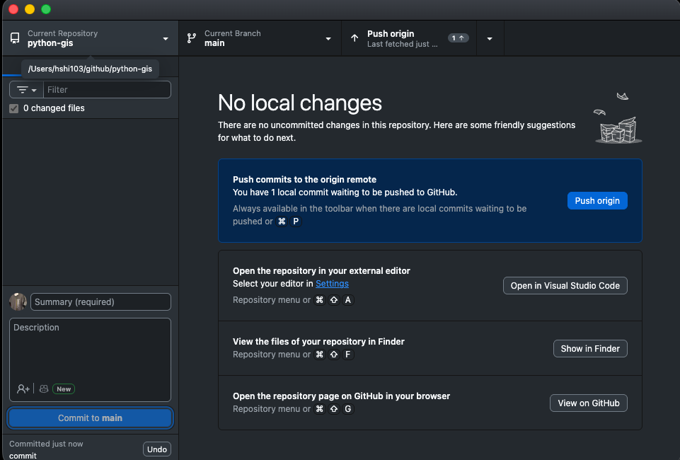
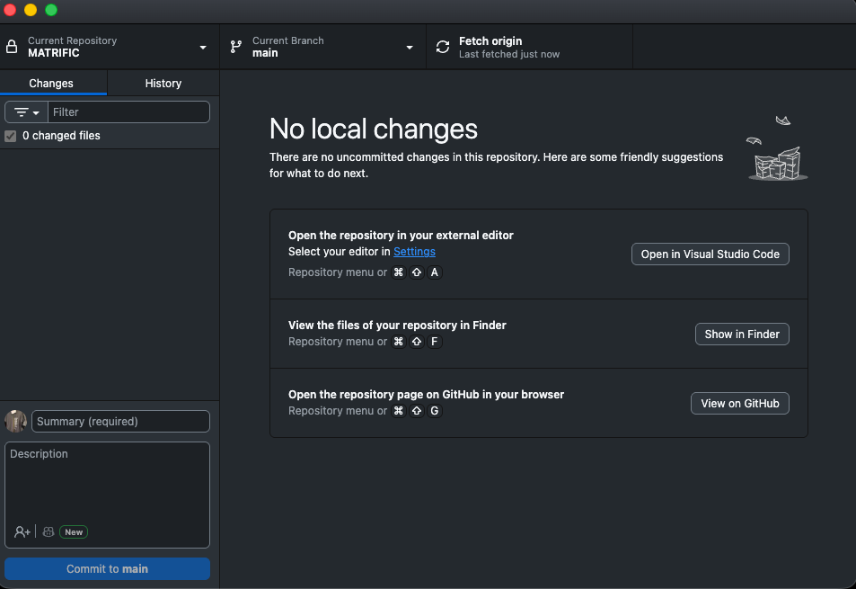
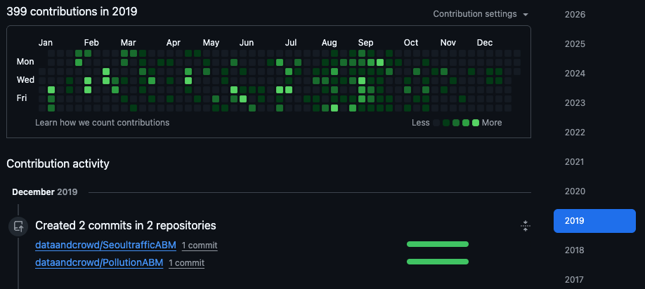

# 1.3 Version control with Git {.unnumbered}

## Story problem

**Why did my analysis change?**

You're working on your class343 GIS project. You run your script on Monday and get one result. On Friday, you run the same script and the results are completely different.

**Questions arise**:
- What changed between Monday and Friday?
- Which version was correct?
- Can you go back to Monday's version?
- How can you share your work with classmates without confusion?

**Answer**: Git tracks every change automatically, like having unlimited "undo" for your entire project.

## What you will learn

- Understand what Git and GitHub are
- Sign up for GitHub (essential for students!)
- Install and use GitHub Desktop
- Track changes in your class343 project
- Share your work on GitHub
- Collaborate safely with version control

---

## Understanding version control

### The problem: Manual version control

Without Git, students often do this:

```
class343/
├── analysis.py
├── analysis_v2.py
├── analysis_v3.py
├── analysis_final.py
├── analysis_final_REALLY.py
└── analysis_final_2024-02-07.py
```

**Problems**:
- Which file is the latest?
- What changed between versions?
- How do you share without confusion?
- How do you work with classmates?

### The solution: Git + GitHub

Git tracks every change automatically:

```
class343/
└── analysis.py  ← One file, entire history tracked

Git history:
├── Monday 9am:    "Initial analysis"
├── Tuesday 2pm:   "Fixed bug in coordinates"
├── Thursday 10am: "Added visualisation"
└── Friday 4pm:    "Final report version"
```

**Benefits**:
- Complete history of every change
- See exactly what changed when
- Revert to any previous version
- Share work easily on GitHub
- Collaborate with classmates safely

---

## What are Git and GitHub?

### Git
- A **version control system** installed on your computer
- Tracks changes to your files
- Works **locally** (offline)
- Free and open source

### GitHub
- A **website** that hosts Git repositories
- Like "Dropbox for code"
- Enables collaboration and sharing
- Shows your portfolio to potential employers
- Free for students

### The relationship

```
Your computer          │          GitHub.com
                       │
class343/              │          Your GitHub profile
├── .git/    ←────────┼────────→  class343 repository
├── analysis.py        │          (visible to others)
└── data/              │
```

You work locally with Git, then "push" to GitHub to share and backup.

---

## Step 1: Create a GitHub account

### Sign up for GitHub

1. Go to [github.com/signup](https://github.com/signup)
2. Enter your **University of Auckland email** (important for student benefits!)
3. Choose a **professional username** (e.g., `hshin-uoa` not `xXCoolGuy420Xx`)
4. Verify your email address


::: {.callout-tip title="Why use your university email?"}
- Get [GitHub Student Developer Pack](https://education.github.com/pack) (free!)
- Access to GitHub Copilot and other premium features
- Shows you're a verified student
:::

### Apply for Student Developer Pack

1. Go to [education.github.com/pack](https://education.github.com/pack)
2. Click "Sign up for Student Developer Pack"
3. Verify you're a student (upload student ID if needed)
4. Get access to premium tools worth $200,000+!


---

## Step 2: Install GitHub Desktop

### Why GitHub Desktop?

GitHub Desktop is a **visual app** that makes Git easy:
- No command line required
- See your changes visually
- Push to GitHub with one click
- Perfect for beginners

### Download and install

::: {.panel-tabset}

## macOS

1. Go to [desktop.github.com](https://desktop.github.com)
2. Download GitHub Desktop for macOS
3. Open the downloaded file
4. Drag GitHub Desktop to Applications folder
5. Open GitHub Desktop from Applications

## Windows

1. Go to [desktop.github.com](https://desktop.github.com)
2. Download GitHub Desktop for Windows
3. Run the installer (GitHubDesktopSetup.exe)
4. Wait for installation to complete
5. GitHub Desktop will open automatically

:::


### Sign in to GitHub Desktop

1. GitHub Desktop will ask you to sign in
2. Click "Sign in to GitHub.com"
3. Your browser will open
4. Authorise GitHub Desktop
5. Return to GitHub Desktop


### Configure your identity

GitHub Desktop will ask for:

- Your name (appears in commits)
- Your email (use your GitHub email)


---

## Step 3: Turn class343 into a Git repository

Now let's track your class343 project!

### Add your project to GitHub Desktop

1. Open GitHub Desktop
2. Click **File → Add Local Repository**
3. Navigate to your `class343` folder (should be in `Documents/class343`)
4. Click **Choose**


You'll see an error: "This directory does not appear to be a Git repository"

That's expected! Click **"Create a repository"** instead.


### Create the repository

A dialog appears:

1. **Name**: `class343` (should be filled in)
2. **Description**: "GISCI 343 coursework and projects"
3. **Local path**: Should show your Documents folder
4. ✅ **Initialise this repository with a README**
5. **Git ignore**: Select **Python** from dropdown
6. **License**: None (for now)

Click **Create Repository**


::: {.callout-important title="What just happened?"}

GitHub Desktop:

- Created a `.git` folder (hidden) to track changes
- Created a `.gitignore` file to ignore `.venv` and Python cache files
- Created a `README.md` file
- Made your first commit: "Initial commit"
:::

---

## Step 4: Understanding the GitHub Desktop interface

Let's explore what you're seeing:


**Left panel - Changes**:

- Shows files you've modified
- Green + means new file
- Yellow dot means modified file
- Red - means deleted file

**Centre panel - Diff view**:

- Shows exactly what changed
- Green = added lines
- Red = deleted lines

**Bottom left - Commit**:

- Summary: Short description of changes
- Description: Detailed explanation (optional)
- "Commit to main" button

**Top bar**:

- Current Repository: Which project you're viewing
- Current Branch: Usually "main"
- Fetch origin / Push origin: Sync with GitHub

---

## Step 5: Making your first commit

Let's make a change and commit it!

### Make a change

1. Open your `class343` folder in your file explorer
2. Open `hello.py` in your code editor
3. Add a comment at the top:

```python
# GISCI 343 - Introduction to GIS Programming
# Author: Your Name
# Date: 2024-02-07

def main():
    print("Hello from Python!")
```

4. Save the file

### See the change in GitHub Desktop

Switch back to GitHub Desktop. You'll see:

1. Left panel shows `hello.py` with a yellow dot (modified)
2. Click on `hello.py`
3. Centre panel shows your changes:
   - Green lines = what you added
   - Red lines = what was removed (if any)


### Commit the change

Bottom left corner:

1. **Summary**: Type `Add author information to hello.py`
2. **Description**: (Optional) "Added header comment with course info"
3. Click **Commit to main**


**Success!** Your change is now saved in Git history.

::: {.callout-tip title="Writing good commit messages"}
**Good messages** (specific and clear):

- ✅ "Add author information to hello.py"
- ✅ "Fix bug in coordinate transformation"
- ✅ "Add Auckland parks dataset"

**Bad messages** (vague):

- ❌ "Update"
- ❌ "Changes"
- ❌ "Fixed stuff"
:::

---

## Step 6: Viewing your history

Click **History** tab (top left).

You'll see all your commits:

- Initial commit (created by GitHub Desktop)
- Add author information to hello.py (your commit)


Click on any commit to see:

- When it was made
- Who made it
- What changed

This is your time machine! You can see everything that happened in your project.

---

## Step 7: Publishing to GitHub

Now let's share your project on GitHub!

### Publish repository

1. Click **Publish repository** button (top right)



A dialog appears:

2. **Name**: `class343`
3. **Description**: "GISCI 343 coursework and projects"
4. ❌ **Keep this code private** (UNCHECK this - make it public so you can share)
5. Click **Publish Repository**


**Success!** Your project is now on GitHub.

### View on GitHub

1. Click **Repository → View on GitHub**



Your browser opens to your GitHub repository. You can see:
- Your files
- Your README
- Your commit history
- The URL you can share with others


---

## Step 8: The daily workflow

Here's the workflow you'll use every day:

### 1. Work on your project

Edit your files as normal:
- Write Python scripts
- Add data files
- Create notebooks
- Update documentation

### 2. Check changes in GitHub Desktop

1. Open GitHub Desktop
2. See what files changed (left panel)
3. Review the changes (centre panel)


### 3. Commit your changes

1. Write a summary message
2. Optionally add description
3. Click **Commit to main**

### 4. Push to GitHub

After committing, click **Push origin** (top right).

This uploads your commits to GitHub.

::: {.callout-tip title="When to commit?"}
Commit whenever you complete a logical unit of work:

- ✅ After fixing a bug
- ✅ After adding a new feature
- ✅ After completing a data analysis step
- ✅ At the end of your work session

Don't commit:

- ❌ Every single character you type
- ❌ Broken/non-working code
- ❌ **Sensitive information (passwords, API keys)**
:::

On your github site (https://github.com/your-user-id), you can see a time series waffle plot that keeps track of your **"commits"**.




---

## Step 9: Best practices for your class343 project

### 1. Commit often

Make small, focused commits:

```
✅ Good commit history:

- "Add data loading function"
- "Calculate distance to nearest park"
- "Create visualisation"
- "Update README with results"

❌ Bad commit history:

- "Everything done" (one huge commit at the end)
```

### 2. Don't commit large files

The `.gitignore` file already excludes:

- `.venv/` folder
- `__pycache__/` folders
- Large data files (`.csv`, `.shp`, `.tif`, etc.)

::: {.callout-warning title="GitHub file size limits"}
- Files over 50MB will generate warnings
- Files over 100MB will be rejected
- Large datasets should be stored elsewhere (Google Drive, OneDrive)
- Only commit small sample datasets for testing
:::

### 3. Write meaningful commit messages

Think: "If I look at this in 6 months, will I understand what I did?"

**Format**:
```
Short summary (50 characters or less)

Optional detailed explanation:

- What changed
- Why it changed
- Any important details
```

### 4. Push regularly

Push to GitHub at least once per work session:

- Backs up your work
- Shows your progress
- Enables collaboration

### 5. Never commit sensitive information

**Never commit**:

- Passwords
- API keys
- Personal data
- University credentials

If you accidentally commit something sensitive:

1. Don't panic
2. Contact your instructor
3. Delete the repository and start fresh

---

## Summary

You've learnt:

- [x] What Git and GitHub are
- [x] How to create a GitHub account
- [x] How to install and use GitHub Desktop
- [x] How to commit changes
- [x] How to push to GitHub
- [x] The daily Git workflow
- [x] Best practices for version control

**Key insight**: Version control is your safety net and collaboration tool. Commit often, push regularly!

**Next step**: Use this workflow for all your class343 projects throughout the semester.

---

## Quick reference

### Daily workflow

```
1. Work on your files
2. Open GitHub Desktop
3. Review changes
4. Write commit message
5. Click "Commit to main"
6. Click "Push origin"
```

### Keyboard shortcuts (GitHub Desktop)

- **Cmd/Ctrl + N**: Create new commit
- **Cmd/Ctrl + R**: Show repository in file explorer
- **Cmd/Ctrl + Shift + G**: View on GitHub
- **Cmd/Ctrl + ,**: Open preferences

---

## Additional resources

- [GitHub Desktop Documentation](https://docs.github.com/en/desktop)
- [GitHub Student Developer Pack](https://education.github.com/pack)
- [GitHub Learning Lab](https://lab.github.com/)
- [Git Handbook](https://guides.github.com/introduction/git-handbook/)

---

**Congratulations!** Your class343 project is now version-controlled and backed up on GitHub. You're building a portfolio while learning GIS! 🎉

::: {.callout-tip title="Pro tip"}
Keep using Git for ALL your coursework throughout the semester. By the end, you'll have:
- A complete portfolio on GitHub
- A history of your learning journey
- Projects you can showcase to employers
- Backup of all your work
:::
