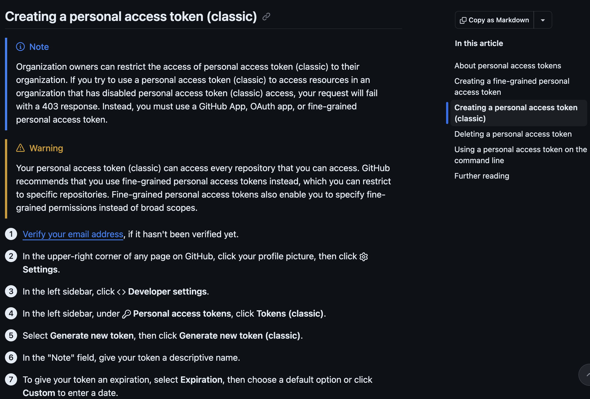

# 1.5 Authenticating with GitHub {.unnumbered}

## Story problem

**Why does GitHub keep refusing me?**

You have followed Section 1.3, you have a GitHub account, you have installed GitHub Desktop, and your `class343` project is sitting happily under version control. Then Lab 6 asks you to **Publish repository** in GitHub Desktop, and either nothing happens, the publish button spins forever, or you see a message like:

```
Authentication failed. Some common reasons include:
- You are not signed in to GitHub.com
- Your credentials have expired
```

This is not a bug. GitHub refuses anonymous pushes, and since 2021 it no longer accepts your account password as a credential. Signing in to github.com in a browser is only half of it: GitHub Desktop also needs a valid credential for **your** account. The simplest way to provide one is a **personal access token** (PAT) that lasts the whole semester.

## What you will learn

- Why GitHub needs a second form of authentication, even after you sign in to github.com in a browser
- How to confirm you are logged in to the right GitHub account
- How to create a fine-grained personal access token that lasts the full semester
- How to sign in to GitHub Desktop with that token
- What to do when things still go wrong

::: {.callout-note title="What about SSH keys?"}
SSH keys are the other supported method and are what most developers use day to day on the terminal. They are a bit more involved to set up (key generation, agents, `~/.ssh/config`) and some university or corporate networks block outbound port 22, which breaks SSH entirely.

For this course we recommend a personal access token because it works everywhere, plays nicely with GitHub Desktop, and takes about five minutes. If you want to learn SSH later, GitHub has a good walkthrough: [Connecting to GitHub with SSH](https://docs.github.com/en/authentication/connecting-to-github-with-ssh).
:::

---

## Step 0: Make sure you are logged in to GitHub

Before you generate anything, confirm that your browser is signed in as **the GitHub account you intend to push from**. This sounds obvious, but many auth failures come from the laptop pushing as one user while the browser is logged in as another (often a personal vs. university account).

1. Open [github.com](https://github.com) in the browser you will use for the rest of this workflow.
2. Click your avatar in the top-right corner. Confirm the username shown is the one you signed up with in Section 1.3, using your University of Auckland email.
3. If it is the wrong account, sign out and sign back in as the correct one.
4. While you are there, click **Your repositories** and make sure you can see the repos you expect. If you cannot, you are signed in to the wrong account.

Keep this tab open. You will come back to it in Step 2.

::: {.callout-tip title="Two-factor authentication"}
GitHub requires 2FA for most accounts now. If you have not set it up, do so before generating a token: [Settings -> Password and authentication](https://github.com/settings/security). You can use an authenticator app (recommended) or SMS. The token flow below assumes 2FA is enabled.
:::

---

## Step 1: Understand what a personal access token is

A **personal access token** (PAT) is a long random string that acts as a scoped replacement for your password. A few properties worth knowing:

- It belongs to **you**, not to a particular machine. The same token can be used on your laptop and your office desktop, or revoked from either.
- You can limit **which repositories** it can touch and **what it can do** (read only, read + write, etc.).
- It has an **expiry date**. When it expires, GitHub Desktop starts failing to push until you generate a new one.
- If it leaks, you revoke it from a web page, not by changing your password.

GitHub offers two kinds of tokens:

- **Classic tokens** (what we will use below). Scoped with a small set of permissions such as `repo`, which covers everything you need for this course.
- **Fine-grained tokens** (newer). Let you restrict a token to specific repositories and individual permissions. Worth learning once you are comfortable, but overkill for a classroom workflow.

For the full reference on how tokens work, when to use which, and how to manage expiry, see the official GitHub docs: [Managing your personal access tokens -- Creating a personal access token (classic)](https://docs.github.com/en/authentication/keeping-your-account-and-data-secure/managing-your-personal-access-tokens#creating-a-personal-access-token-classic).

---

## Step 2: Generate a personal access token (classic)

1. Still signed in to GitHub, open [github.com/settings/tokens](https://github.com/settings/tokens).
2. Click **Generate new token**, then **Generate new token (classic)**. If GitHub asks you to confirm your password or a 2FA code, do so.
3. **Note**: something you will recognise in six months, e.g. `UoA laptop (2026), GISCI 343`.
4. **Expiration**: pick **90 days**. This covers the remainder of the semester (including the Assignment 2 deadline on 10 May 2026 and any follow-up marking), so you will not need to regenerate before the course ends. If you prefer a fixed end date, use *Custom* and pick one just past the end of semester.
5. **Select scopes**: tick **`repo`** (the whole block: *repo:status*, *repo_deployment*, *public_repo*, *repo:invite*, *security_events* will all highlight). That is all you need for cloning, pushing and publishing repositories from GitHub Desktop. Leave every other scope unticked.
6. Click **Generate token** at the bottom of the page.
7. GitHub shows the token exactly **once**, as a string starting `ghp_...`. **Copy it now** into a secure place (a password manager if you have one). If you lose it, you will have to regenerate.

**For reference, please visit [https://docs.github.com/en/authentication/keeping-your-account-and-data-secure/managing-your-personal-access-tokens#creating-a-personal-access-token-classic (screenshot below)](https://docs.github.com/en/authentication/keeping-your-account-and-data-secure/managing-your-personal-access-tokens#creating-a-personal-access-token-classic)**

{width=80%}


::: {.callout-warning title="Treat the token like a password"}
Anyone with your PAT can push and pull from your repos as you. Do **not** paste it into chat, commit it to git, email it to yourself, or store it in a plain text file in your project folder. If you suspect it has leaked, revoke it immediately from [github.com/settings/tokens](https://github.com/settings/tokens) and generate a new one.
:::

::: {.callout-tip title="Calendar reminder"}
Put a reminder in your calendar **two weeks before** the token expiry date. When it pops up, come back to this section and generate a new one. Future-you will thank present-you.
:::

---

## Step 3: Sign in to GitHub Desktop

GitHub Desktop stores your credentials once and reuses them for every push afterwards. Do this once and Lab 6, Lab 7, and Assignment 2 will all just work.

1. Open **GitHub Desktop**. On macOS, go to **GitHub Desktop -> Settings -> Accounts**. On Windows, go to **File -> Options -> Accounts**. If a wrong account is already listed (e.g. a personal account instead of your UoA one), click **Sign out** first, then **Sign In** next to *GitHub.com*.
2. In the sign-in dialog, click **Sign in using your browser**.
3. Your browser opens a GitHub page that says something like *"GitHub Desktop would like permission to access your account"*. Make sure the account shown is the correct one (the username from Step 0). If it is not, click **Not <other-user>?** and switch.
4. Click **Authorize desktop**.
5. The browser hands control back to GitHub Desktop, which now shows your username and avatar under **Accounts** with a green tick. Close the settings window.

To verify, open (or reopen) any repository in GitHub Desktop and hit **Fetch origin** in the top bar. If the button spins for a second and then settles quietly, authentication is working.

::: {.callout-note title="If the browser round-trip fails"}
If the browser opens and you click **Authorize desktop** but GitHub Desktop stays stuck on the sign-in screen (rare, usually a locked-down network or an ad-blocker), you can sign in manually instead. In the sign-in dialog, choose the **username and password** option, put your GitHub username in the username field, and paste the **token** from Step 2 into the password field.
:::

---

## Troubleshooting

### "Authentication failed" when I click Publish repository

Your stored credential has expired, been revoked, or never worked in the first place.

1. Check the token is still active at [github.com/settings/tokens](https://github.com/settings/tokens). If it has expired, generate a new one (Step 2) and sign back in (Step 3).
2. In GitHub Desktop, sign out of the account (*Settings / Options -> Accounts -> Sign out*), then sign in again.

### The browser sign-in never completes

The browser opens, you click **Authorize desktop**, but GitHub Desktop does not register the login. This is usually a network or browser extension issue.

- Try a different browser as the default (Chrome, Edge, Firefox, Safari).
- Disable any ad-blocker or privacy extension temporarily and retry.
- Fall back to the token path in Step 3c.

### GitHub Desktop keeps pushing as the wrong user

You have two accounts signed in, or the cached credential belongs to someone else. Sign out fully, clear any `github.com` entries from your OS credential store (Keychain on macOS, Credential Manager on Windows), and sign in again with the correct account.

### "Could not resolve host: github.com"

Not an auth problem, a network one. Check your wifi, try a different network, or check whether your university VPN is filtering DNS.

### Publish repository says "already exists"

Not an auth problem either. The repository on GitHub already has content (often a README) that your local repo does not know about. See the Lab 6 callout on non-empty remotes.

### I really need to use the terminal

Section 1.5 assumes GitHub Desktop. If you prefer the command line, GitHub's guide walks through the credential helper setup in full: [Caching your GitHub credentials in Git](https://docs.github.com/en/get-started/git-basics/caching-your-github-credentials-in-git). The same token you generated in Step 2 works there.

---

## Summary

You now know:

- Why `Publish repository` needs its own authentication, even after you have signed in to GitHub.com in a browser
- How to check you are on the correct GitHub account before you generate anything
- How to create a fine-grained personal access token that lasts the whole semester
- How to sign GitHub Desktop in with that token (browser path or token path)
- How to diagnose the common failure modes

**Key insight**: do this **once**, and every lab afterwards (Lab 6, Lab 7, your Assignment 2 deployment) just works. Skip it, and you will spend lab time fighting `Authentication failed` instead of doing GIS.

---

## Quick reference

### One-time PAT + GitHub Desktop setup

```text
0. Confirm you are signed in to the correct GitHub account in the browser.
1. Generate a classic token:
   https://github.com/settings/tokens
   Generate new token -> Generate new token (classic)
   Expiration: 90 days (covers the semester)
   Scope: tick `repo`
   Copy the token now (shown only once, starts with ghp_).
2. Open GitHub Desktop.
   macOS:   GitHub Desktop -> Settings -> Accounts -> Sign In
   Windows: File -> Options -> Accounts -> Sign In
3. Sign in using your browser -> Authorize desktop.
   (If that stalls, paste the token in the password field of the manual sign-in.)
4. Fetch origin on any repo. If it works silently, you are done.
```

---

## Additional resources

- [GitHub Docs: Managing your personal access tokens -- Creating a personal access token (classic)](https://docs.github.com/en/authentication/keeping-your-account-and-data-secure/managing-your-personal-access-tokens#creating-a-personal-access-token-classic) (the authoritative reference for this section)
- [GitHub Docs: Authenticating to GitHub in GitHub Desktop](https://docs.github.com/en/desktop/installing-and-authenticating-to-github-desktop/authenticating-to-github-in-github-desktop)
- [GitHub Docs: Caching your GitHub credentials in Git](https://docs.github.com/en/get-started/git-basics/caching-your-github-credentials-in-git) (if you end up using the terminal later)
- [GitHub Docs: Connecting to GitHub with SSH](https://docs.github.com/en/authentication/connecting-to-github-with-ssh) (if you would rather use an SSH key)
