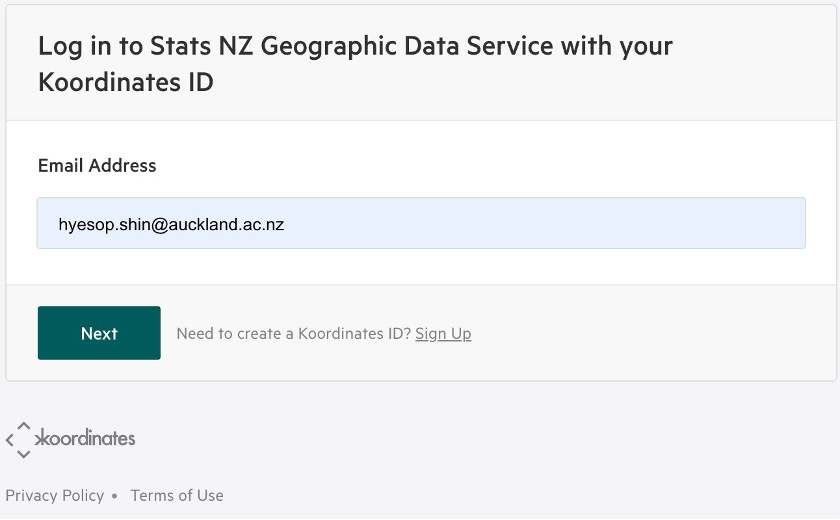
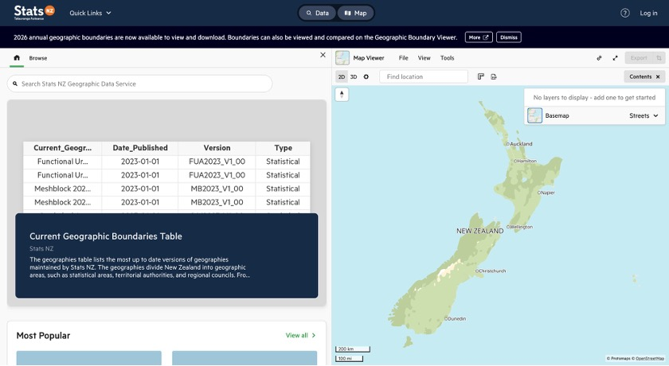
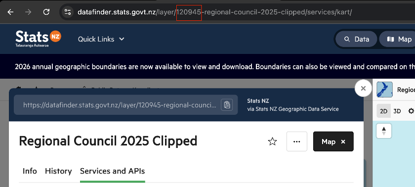
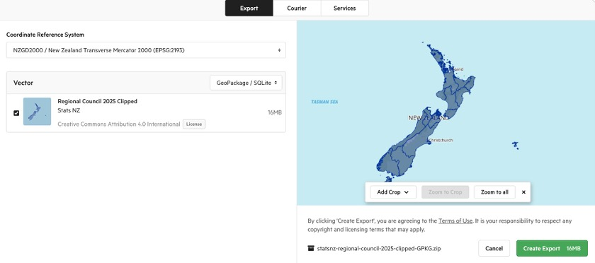
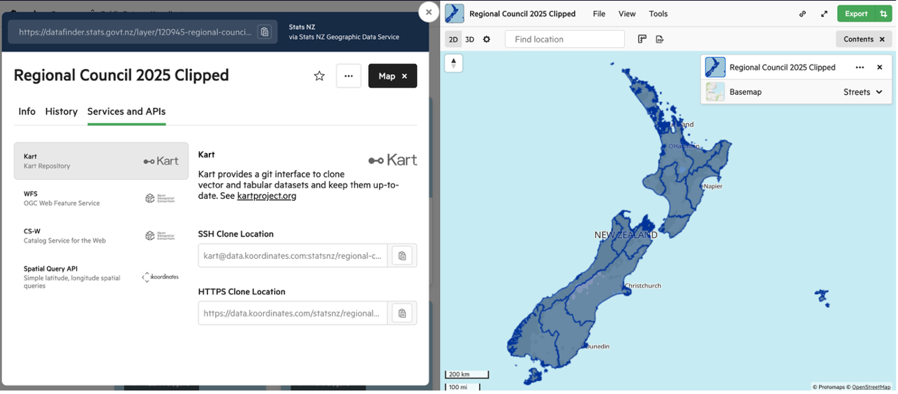

# Lab Week 04 {.unnumbered}

## Overview

This lab introduces you to working with **web APIs** (Application Programming Interfaces) to download geospatial data programmatically. You will start with two short, self-contained examples that demonstrate how APIs work in practice, then move on to New Zealand's national spatial data services.

**Duration:** approximately 2 hours

**What you need:**

- Python 3.10+ with `requests`, `geopandas`, `matplotlib`, `pandas`, `contextily`, and (optionally) `holoviews` / `hvplot` installed
- A Python script, Jupyter notebook, or Quarto document to write your code

**Structure:**

| Section | Topic | Approx. Time |
|------|-------|--------------|
| 1 | Earthquake data from USGS | 15 min |
| 2 | Philadelphia shootings from CARTO | 30 min |
| 3 | Downloading GIS data from Stats NZ and LINZ | 75 min |

---

# Section 1: Earthquake Data from USGS {.unnumbered}

## What is an API?

An API (Application Programming Interface) is a set of rules that lets your code talk to a remote server and request data. Instead of downloading a file manually from a website, you send a structured request to a URL and receive structured data back. This is the foundation of reproducible data acquisition: your script *is* the download step.

## Downloading Earthquake Data

We begin with the simplest possible API example. The United States Geological Survey (USGS) publishes a real-time feed of recent earthquakes as GeoJSON. Because `geopandas` can read GeoJSON directly from a URL, a single line of code is enough to turn this feed into a spatial dataframe.

The USGS earthquake feed at [earthquake.usgs.gov](https://earthquake.usgs.gov/earthquakes/feed/v1.0/summary/2.5_week.geojson) returns all magnitude 2.5+ earthquakes from the past seven days.

```{python}
#| eval: false
import geopandas as gpd

# Download data on magnitude 2.5+ quakes from the past week
endpoint_url = (
     "http://earthquake.usgs.gov/earthquakes/feed/v1.0/summary/2.5_week.geojson"
 )
earthquakes = gpd.read_file(endpoint_url)
print(earthquakes.head())
```

That is the entire script. The key insight is that the USGS server returns a GeoJSON `FeatureCollection`, which is a format that GeoPandas understands natively. No authentication is required for this feed.

::: {.callout-tip}
## Try it yourself

Run the code above and inspect the resulting dataframe. What columns are available? Try plotting the earthquakes on a world map with `earthquakes.plot()`. You can also colour the points by magnitude: `earthquakes.plot(column="mag", cmap="OrRd", legend=True)`.
:::

## Understanding the Pattern

Even though this example is short, it demonstrates the core API pattern that we will use throughout this lab:

| Step | What happens |
|------|-------------|
| 1. Construct a URL | The URL encodes *what* you want (earthquake data, magnitude 2.5+, past week) |
| 2. Send a request | `gpd.read_file()` sends an HTTP GET request to the server |
| 3. Parse the response | The GeoJSON response is automatically converted to a GeoDataFrame |

In Parts 2 and 3, we will see how to add query parameters, authentication, and more complex workflows, but the fundamental pattern remains the same.

---

# Section 2: Philadelphia Shootings from CARTO {.unnumbered}

This example uses the **CARTO SQL API**, which lets you query a hosted PostGIS database using SQL. The City of Philadelphia publishes its shootings data through CARTO, and we can construct queries to filter, aggregate, and download exactly the subset we need.

## Step 1: Query the API

Unlike the USGS feed, the CARTO API takes **query parameters**. We pass a SQL query (`q`), the output format (`format`), and optionally which fields to skip.

```{python}
#| eval: false
import geopandas as gpd
import pandas as pd
import requests
from matplotlib import pyplot as plt

pd.options.display.max_columns = 999

# The API endpoint
carto_api_endpoint = "https://phl.carto.com/api/v2/sql"

# The query parameters
params = {
    "q": "SELECT * FROM shootings",
    "format": "geojson",
    "skipfields": "cartodb_id",
}

response = requests.get(carto_api_endpoint, params=params)
response
```

::: {.callout-note}
## SQL via API

The CARTO SQL API is powerful because it lets you run arbitrary SQL queries on the server side. This means you can filter and aggregate data *before* downloading it, reducing both bandwidth and processing time on your local machine.
:::

## Step 2: Parse the Response

The response is a GeoJSON dictionary. We can inspect its structure and then convert it to a GeoDataFrame.

```{python}
#| eval: false
# Get the returned data in JSON format
# This is a dictionary
features = response.json()
type(features)

# What are the keys?
list(features.keys())

# Let's look at the first feature
features["features"][0]

# Create a GeoDataFrame
shootings = gpd.GeoDataFrame.from_features(features, crs="EPSG:4326")
shootings.head()
```

## Step 3: Clean and Project

```{python}
#| eval: false
# Make sure we remove missing geometries
shootings = shootings.dropna(subset=["geometry"])

# Convert to a better CRS
shootings = shootings.to_crs(epsg=3857)

# Load city limits to clip the data
city_limits = gpd.read_file(
    "https://opendata.arcgis.com/datasets/405ec3da942d4e20869d4e1449a2be48_0.geojson"
).to_crs(epsg=3857)

# Remove any shootings that are outside the city limits
shootings = gpd.sjoin(
    shootings, city_limits, predicate="within", how="inner"
).drop(columns=["index_right"])
```

## Step 4: Visualisation

With the cleaned data in hand, we can produce two complementary visualisations: a point map and a hexbin map.

```{python}
#| eval: false
# From Open Data Philly
zip_codes = gpd.read_file(
    "https://opendata.arcgis.com/datasets/b54ec5210cee41c3a884c9086f7af1be_0.geojson"
).to_crs(epsg=3857)

fig, ax = plt.subplots(figsize=(6, 6))

# ZIP Codes
zip_codes.plot(ax=ax, facecolor="none", edgecolor="black")

# Shootings
shootings.plot(ax=ax, color="crimson", markersize=10, alpha=0.4)
ax.set_axis_off()
```

### Hexbin Map

A hexbin map aggregates point events into hexagonal bins, revealing density patterns that are hard to see in a simple point map.

```{python}
#| eval: false
# Initialize the axes
fig, ax = plt.subplots(figsize=(10, 10), facecolor=plt.get_cmap("viridis")(0))

# Convert to Web Mercator and plot the hexbins
x = shootings.geometry.x
y = shootings.geometry.y
ax.hexbin(x, y, gridsize=40, mincnt=1, cmap="viridis")

# Overlay the city limits
zip_codes.plot(ax=ax, facecolor="none", linewidth=0.5, edgecolor="white")
ax.set_axis_off()
```

## Step 5: Filtering with SQL

One of the strengths of the CARTO API is that you can filter on the server side using SQL.

```{python}
#| eval: false
# Example: Count the total number of rows in a table
response = requests.get(
    carto_api_endpoint, params={"q": "SELECT COUNT(*) FROM shootings"}
)
response.json()

# Select nonfatal shootings only
query = "SELECT * FROM shootings WHERE fatal = 0"
params = {"q": query, "format": "geojson"}
response = requests.get(carto_api_endpoint, params=params)

# Make the GeoDataFrame
nonfatal = gpd.GeoDataFrame.from_features(response.json(), crs="EPSG:4326")
print("number of nonfatal shootings = ", len(nonfatal))

# Select based on "date_"
query = "SELECT * FROM shootings WHERE date_ >= '1/1/23'"
params = {"q": query, "format": "geojson"}
response = requests.get(carto_api_endpoint, params=params)

# Make the GeoDataFrame
shootings_2023 = gpd.GeoDataFrame.from_features(response.json(), crs="EPSG:4326")
print("number of shootings in 2023 = ", len(shootings_2023))
```

## At-Home Exercise: Explore Trends by Month and Day of Week

```{python}
#| eval: false
# Convert the date column to a datetime object
shootings["date"] = pd.to_datetime(shootings["date_"])

# Add new columns: Month and Day of Week
shootings["Month"] = shootings["date"].dt.month
shootings["Day of Week"] = shootings["date"].dt.dayofweek  # Monday is 0, Sunday is 6

count = shootings.groupby(["Month", "Day of Week"]).size()
count = count.reset_index(name="Count")
count.head()
```

```{python}
#| eval: false
import hvplot.pandas

# Remember 0 is Monday and 6 is Sunday
count.hvplot.heatmap(
    x="Day of Week",
    y="Month",
    C="Count",
    cmap="viridis",
    width=400,
    height=500,
    flip_yaxis=True,
)
```

::: {.callout-tip}
## Key takeaway from Section 2

The CARTO example shows a more realistic API workflow: you construct query parameters, send a request with `requests.get()`, parse the JSON response, and convert it to a GeoDataFrame. This pattern appears in many geospatial web services.
:::

---

# Section 3: Downloading GIS Data from Stats NZ and LINZ {#sec-lab-statsNZ .unnumbered}

## Introduction

This part introduces two programmatic methods for downloading GIS layers from New Zealand's national spatial data services: the **Stats NZ Geographic Data Service** ([datafinder.stats.govt.nz](https://datafinder.stats.govt.nz/)) and the **LINZ Data Service** ([data.linz.govt.nz](https://data.linz.govt.nz/)). Rather than clicking through the web interface every time, you will write Python scripts that fetch, poll, and load geospatial data automatically. This is an essential habit in reproducible research: when your data acquisition step is scripted, anyone can re-run your entire workflow from scratch.

Both services are built on the **Koordinates** platform, which exposes a REST API. Every dataset you can browse in the web interface is also accessible programmatically using either of the two methods below.

::: {.callout-note}
## Why programmatic download?

A manual download is fine for a one-off task, but it breaks reproducibility. If you are sharing your analysis through GitHub, a Quarto report, or a package, your collaborators cannot re-run the data acquisition step unless the exact same file is committed to the repository (which is impractical for large GIS files). A short script that downloads the data on demand is far more transparent and maintainable.
:::

### Methods covered

| Method | Approach | Best for |
|--------|----------|----------|
| **Method A** | Koordinates Export API | Saving a local GeoPackage or Shapefile; offline workflows |
| **Method B** | WFS (Web Feature Service) | Loading directly into a GeoDataFrame; spatial subsetting with a bounding box |

---

## Prerequisites

Make sure the following packages are installed before starting:

```{python}
#| eval: false
# Install if needed
# uv pip install requests geopandas matplotlib contextily
```

```{python}
#| eval: false
import requests
import time
import zipfile
import io
import geopandas as gpd
import matplotlib.pyplot as plt
```

---

## Step 1: Create an Account and Obtain an API Key

Both methods require a personal API key. Navigate to the Stats NZ Geographic Data Service and log in using your Koordinates ID. If you do not yet have one, click **Sign Up** on the login page.

{fig-alt="Login page for Stats NZ Geographic Data Service showing email input and Next button" width="60%"}

Once logged in, go to:

> **[https://datafinder.stats.govt.nz/my/api/](https://datafinder.stats.govt.nz/my/api/)**

Click **Create API Key**, give it a descriptive name (for example, `GISCI343`), and copy the key value. You will not be shown the full key again after navigating away from the page.

::: {.callout-warning}
## Keep your API key private

Your API key is a credential. Treat it like a password. Never paste it directly into a shared notebook or commit it to a public repository.

Store it in a separate file (for example `config.py`) that is listed in your `.gitignore`:

```python
# config.py  ← add this filename to .gitignore
API_KEY = "your_key_here"
```

Then import it in your analysis script:

```python
from config import API_KEY
```
:::

---

## Step 2: Find the Layer You Need

For this lab we will use the **Regional Council 2025 Clipped** layer (Layer ID: `120945`), which contains the 17 regional boundaries of New Zealand.

Navigate to the layer page to review the metadata before downloading:

> **[https://datafinder.stats.govt.nz/layer/120945-regional-council-2025-clipped/](https://datafinder.stats.govt.nz/layer/120945-regional-council-2025-clipped/)**

The homepage provides a search bar and a catalogue of all available datasets:

{fig-alt="Stats NZ Geographic Data Service homepage showing search bar, a data table, and a map of New Zealand" width="100%"}

### Finding the Layer ID

Every API request requires the **Layer ID**, the integer that uniquely identifies a dataset. There are two ways to find it.

**Method 1: Read it from the URL**

When you open any layer page, the Layer ID is embedded directly in the browser address bar:

```
https://datafinder.stats.govt.nz/layer/120945-regional-council-2025-clipped/
                                       ^^^^^^
                                       This is the Layer ID
```

**Method 2: Read it from the Info tab**

Open the layer page and make sure the **Info** tab is selected (it is the default). Scroll down below the thumbnail and you will see a metadata row showing Date Added, Last Updated, Views, Exports, and **Layer ID**. The number displayed there (e.g. `120945`) is what you use in your script.

{fig-alt="Annotated layer page showing Layer ID 120945 circled in the URL and highlighted in the Info tab metadata row" width="100%"}

::: {.callout-tip}
## Quick tip: search first, then check the URL

Search for the dataset you need using the search bar on the homepage. Once you have opened the correct layer page, copy the integer from the URL. It is always the first numeric segment after `/layer/`. You do not need to navigate anywhere else.
:::

---

## Method A: Koordinates Export API {#sec-lab-statsNZ-export-api}

The Export API creates a downloadable ZIP archive of a layer in a format and CRS of your choice. The workflow has three stages: **create**, **poll**, then **download**.

The settings you choose when calling the API mirror exactly what the web interface shows in the Export dialog:

{fig-alt="Export dialog showing CRS set to NZGD2000 / NZTM 2000 EPSG:2193, format GeoPackage/SQLite, and the layer checkbox ticked" width="100%"}

### Stage 1: Create the Export Job

Send a POST request with a JSON body specifying the layer URL, CRS, and file format. The `Authorization` header carries your API key.

```{python}
#| eval: false
import requests
import time
import zipfile
import io
import geopandas as gpd

from config import API_KEY  # store your key in config.py

LAYER_ID = 120945
BASE_URL = "https://datafinder.stats.govt.nz/services/api/v1.x"

HEADERS = {
    "Authorization": f"key {API_KEY}",
    "Content-Type":  "application/json",
}

payload = {
    "crs":     "EPSG:2193",
    "formats": {"vector": "application/x-ogc-gpkg"},
    "items":   [{"item": f"{BASE_URL}/layers/{LAYER_ID}/"}],
}

response = requests.post(f"{BASE_URL}/exports/", json=payload, headers=HEADERS)
response.raise_for_status()

export_data = response.json()
export_url  = export_data["url"]
print(f"Export job created: {export_url}")
print(f"Current state: {export_data['state']}")
```

::: {.callout-note}
## Available format strings

| Format string | Output |
|---------------|--------|
| `application/x-ogc-gpkg` | GeoPackage (recommended) |
| `application/x-zipped-shp` | Shapefile (ZIP) |
| `application/json` | GeoJSON |
| `text/csv` | CSV (attributes only, no geometry) |
:::

### Stage 2: Poll Until Ready

The export is prepared asynchronously. Check the `state` field every few seconds until it returns `"complete"`.

```{python}
#| eval: false
print("Waiting for export...", end="", flush=True)

while True:
    poll = requests.get(export_url, headers=HEADERS)
    poll.raise_for_status()
    state = poll.json()["state"]
    print(".", end="", flush=True)

    if state == "complete":
        download_url = poll.json()["download_url"]
        print(f"\nReady: {download_url}")
        break
    elif state in ("error", "cancelled"):
        raise RuntimeError(f"Export failed with state: {state}")

    time.sleep(5)
```

### Stage 3: Download and Load

You can either save the ZIP to disk first, or extract it entirely in memory.

```{python}
#| eval: false
# --- Option 1: Save to disk ---
dl = requests.get(download_url, headers=HEADERS, stream=True)
dl.raise_for_status()

with open("regional_council_2025.zip", "wb") as f:
    for chunk in dl.iter_content(chunk_size=8192):
        f.write(chunk)

with zipfile.ZipFile("regional_council_2025.zip") as zf:
    gpkg_name = [n for n in zf.namelist() if n.endswith(".gpkg")][0]
    zf.extractall("regional_council_2025/")

gdf = gpd.read_file(f"regional_council_2025/{gpkg_name}")
print(gdf.shape, gdf.crs)
```

```{python}
#| eval: false
# --- Option 2: Extract entirely in memory (no file saved) ---
dl2 = requests.get(download_url, headers=HEADERS)
with zipfile.ZipFile(io.BytesIO(dl2.content)) as zf:
    gpkg_name = [n for n in zf.namelist() if n.endswith(".gpkg")][0]
    gdf = gpd.read_file(zf.open(gpkg_name))

print(gdf.shape, gdf.crs)
gdf.plot()
```

---

## Method B: WFS (Web Feature Service) {#sec-lab-statsNZ-wfs}

WFS is an OGC standard that lets you stream vector features directly into Python without downloading a ZIP. The endpoint is found under the **Services and APIs** tab on the layer page. Select **WFS** from the left-hand list and choose your API key from the dropdown.

{fig-alt="Services and APIs tab showing Kart, WFS, CS-W, and Spatial Query API options on the left, with WFS endpoint URL on the right" width="100%"}

### Read Directly into a GeoDataFrame

Construct the WFS URL and pass it directly to `gpd.read_file()`. GeoPandas fetches and parses the GeoJSON response automatically.

```{python}
#| eval: false
import geopandas as gpd
from config import API_KEY

LAYER_ID = 120945
wfs_base = f"https://datafinder.stats.govt.nz/services;key={API_KEY}/wfs/"

params = (
    "service=WFS&version=2.0.0&request=GetFeature"
    f"&typeNames=layer-{LAYER_ID}"
    "&outputFormat=application/json"
    "&srsName=EPSG:2193"
)

gdf = gpd.read_file(f"{wfs_base}?{params}")
print(gdf.shape)   # (17, n_columns)
print(gdf.crs)     # EPSG:2193
gdf.plot(figsize=(8, 10))
```

### Spatial Subsetting with a Bounding Box

For large layers, add a `bbox` parameter to retrieve only the features intersecting a defined area:

```{python}
#| eval: false
# Bounding box for Auckland region (EPSG:2193, metres)
# Format: min_easting, min_northing, max_easting, max_northing
bbox = "1730000,5900000,1820000,5990000"

params_bbox = (
    "service=WFS&version=2.0.0&request=GetFeature"
    f"&typeNames=layer-{LAYER_ID}"
    "&outputFormat=application/json&srsName=EPSG:2193"
    f"&bbox={bbox},EPSG:2193"
)

gdf_akl = gpd.read_file(f"{wfs_base}?{params_bbox}")
print(gdf_akl[["REGC2025_1", "LAND_AREA_SQ_KM"]])
gdf_akl.plot(figsize=(6, 6))
```

::: {.callout-tip}
## When should you use the bbox parameter?

The Regional Council layer only has 17 features, so bbox filtering saves little time here. However, for large layers such as meshblocks (~50,000 features) or building outlines (~3 million features), restricting to your study area makes a significant difference in download time and memory usage.
:::

---

## Comparison

| Consideration | Method A: Export API | Method B: WFS |
|---|---|---|
| Saves a local file? | Yes (ZIP + GeoPackage) | No (streams directly) |
| Works offline? | Yes, after first download | No |
| Code complexity | Moderate (3 stages) | Low (single line) |
| Spatial filtering? | No (whole layer only) | Yes (`bbox` parameter) |
| Output formats | GPKG, Shapefile, GeoJSON, CSV | GeoJSON, GML |

---

## Applying the Same Methods to LINZ Data Service {#sec-lab-linz}

The LINZ Data Service ([data.linz.govt.nz](https://data.linz.govt.nz/)) also runs on the Koordinates platform. This means the same two methods (Export API and WFS) work with only minor changes. You will need a separate API key from LINZ: sign up at [data.linz.govt.nz](https://data.linz.govt.nz/), then go to **My Account > API Keys** and generate one.

In this section we will download **NZ Building Outlines (All Sources)** (Layer ID: `101292`) and plot the results for Auckland city centre.

> **[https://data.linz.govt.nz/layer/101292-nz-building-outlines-all-sources/](https://data.linz.govt.nz/layer/101292-nz-building-outlines-all-sources/)**

::: {.callout-important}
## Large layers require spatial filtering

The NZ Building Outlines layer contains approximately 3 million features nationally. Downloading the full layer via WFS is impractical. Always use a bounding box or the Export API when working with large datasets like this.
:::

### LINZ WFS with Bounding Box

The LINZ WFS endpoint uses `cql_filter` with a `bbox()` function for spatial filtering, rather than the standard WFS `bbox` parameter. The geometry column for most LINZ layers is called `shape`.

```{python}
#| eval: false
import json
import requests
import geopandas as gpd
from config import LINZ_API_KEY  # store separately from Stats NZ key

LAYER_ID = 101292
WFS_URL = f"https://data.linz.govt.nz/services;key={LINZ_API_KEY}/wfs"

# Auckland city centre bounding box (EPSG:4326)
# min_lon, min_lat, max_lon, max_lat
BBOX = (174.7339, -36.8679, 174.8013, -36.8284)

params = {
    "service": "WFS",
    "version": "2.0.0",
    "request": "GetFeature",
    "typeNames": f"layer-{LAYER_ID}",
    "outputFormat": "application/json",
    "srsName": "EPSG:4326",
    "count": 50000,
    "cql_filter": (
        f"bbox(shape,{BBOX[0]},{BBOX[1]},{BBOX[2]},{BBOX[3]},'EPSG:4326')"
    ),
}

response = requests.get(WFS_URL, params=params, timeout=300)
response.raise_for_status()

geojson = response.json()
n_features = len(geojson.get("features", []))
print(f"Received {n_features} building outlines.")

# Save to file
with open("auckland_cbd_buildings.geojson", "w") as f:
    json.dump(geojson, f, indent=2)
```

::: {.callout-note}
## Key differences between Stats NZ and LINZ WFS

| Feature | Stats NZ | LINZ |
|---------|----------|------|
| Base URL | `datafinder.stats.govt.nz` | `data.linz.govt.nz` |
| API key | Stats NZ Koordinates account | LINZ Koordinates account |
| Spatial filter | Standard WFS `bbox` parameter | `cql_filter=bbox(shape,...)` |
| Default CRS | EPSG:2193 (NZTM) | EPSG:2193 (NZTM) |
:::

### Plotting the Auckland City Centre Buildings

Once downloaded, load the GeoJSON into a GeoDataFrame and plot with a basemap for geographic context. The `contextily` library adds background map tiles automatically.

```{python}
#| eval: false
import geopandas as gpd
import matplotlib.pyplot as plt

try:
    import contextily as cx
    HAS_BASEMAP = True
except ImportError:
    HAS_BASEMAP = False
    print("contextily not installed -- plotting without basemap.")
    print("Install with: pip install contextily")

gdf = gpd.read_file("auckland_cbd_buildings.geojson")
print(f"Loaded {len(gdf)} building outlines.")

fig, ax = plt.subplots(1, 1, figsize=(12, 12))

if HAS_BASEMAP:
    # Reproject to Web Mercator for basemap tile alignment
    gdf_wm = gdf.to_crs(epsg=3857)
    gdf_wm.plot(
        ax=ax,
        facecolor="tomato",
        edgecolor="darkred",
        linewidth=0.15,
        alpha=0.5,
    )
    cx.add_basemap(ax, source=cx.providers.CartoDB.Positron, zoom=15)
    ax.set_axis_off()
else:
    gdf.plot(
        ax=ax,
        facecolor="steelblue",
        edgecolor="navy",
        linewidth=0.15,
        alpha=0.6,
    )
    ax.set_xlabel("Longitude")
    ax.set_ylabel("Latitude")
    ax.set_aspect("equal")

ax.set_title("Auckland City Centre Building Outlines (LINZ)", fontsize=14)
plt.tight_layout()
plt.savefig("auckland_cbd_buildings.png", dpi=200, bbox_inches="tight")
plt.show()
```

### LINZ Export API

For the full national dataset, the Export API is the better option. The code is nearly identical to the Stats NZ version, with only the base URL and API key changed:

```{python}
#| eval: false
from config import LINZ_API_KEY

LAYER_ID = 101292
BASE_URL = "https://data.linz.govt.nz/services/api/v1"

HEADERS = {
    "Authorization": f"key {LINZ_API_KEY}",
    "Content-Type": "application/json",
}

payload = {
    "crs": "EPSG:2193",
    "formats": {"vector": "application/x-ogc-gpkg"},
    "items": [{"item": f"{BASE_URL}/layers/{LAYER_ID}/"}],
}

response = requests.post(f"{BASE_URL}/exports/", json=payload, headers=HEADERS)
response.raise_for_status()

export_data = response.json()
export_url = export_data["url"]
print(f"Export job created: {export_url}")

# Poll and download using the same Stage 2 and Stage 3 code from Method A.
# Note: the full building outlines export may take several minutes and
# produce a file over 1 GB.
```

---

## Your Turn

::: {.callout-note}
## Exercise 1

Use **Method B (WFS)** to download the **Territorial Authority 2025 Clipped** layer (Layer ID: `120946`) from Stats NZ. Load it into a GeoDataFrame and produce a choropleth map showing land area (`LAND_AREA_SQ_KM`) by territorial authority. Label the Auckland region.
:::

::: {.callout-note}
## Exercise 2

Use **Method A (Export API)** to download the same Territorial Authority layer as a **Shapefile** (use format string `application/x-zipped-shp`). Compare the file size with the GeoPackage equivalent and comment on which format you would recommend and why.
:::

::: {.callout-note}
## Exercise 3

Using the LINZ WFS method from @sec-lab-linz, download the NZ Building Outlines for a different city centre of your choice (e.g. Wellington, Christchurch, or Dunedin). You will need to define an appropriate bounding box for your chosen area. Plot the building footprints and briefly comment on the urban form you observe compared with Auckland.

Hint: use the LINZ map viewer to identify the bounding box coordinates for your study area.
:::

::: {.callout-note}
## Exercise 4 (extension)

Write a reusable Python function `download_koordinates_layer(base_url, layer_id, api_key, crs="EPSG:2193", fmt="application/x-ogc-gpkg")` that wraps the three-stage Export API workflow (create, poll, download) and returns a GeoDataFrame. The function should work with both Stats NZ and LINZ by accepting the base URL as a parameter. Test it on at least two different layers from each service.
:::

---

## Summary

In this lab you have learnt three approaches to programmatic GIS data acquisition:

| Section | Source | Key concept |
|------|--------|-------------|
| Section 1 | USGS Earthquake Feed | Reading GeoJSON directly from a URL with `gpd.read_file()` |
| Section 2 | CARTO SQL API | Sending query parameters with `requests.get()`, server-side SQL filtering |
| Section 3 | Stats NZ / LINZ | Authenticated APIs, Export (create-poll-download) and WFS with spatial subsetting |

The complexity increases from Section 1 to Section 3, but the underlying pattern is consistent: construct a URL or request, send it to a server, and parse the response into a GeoDataFrame. Once this pattern is internalised, you can apply it to virtually any geospatial web service.

---

## Further Reading

- [Koordinates Export API documentation](https://help.koordinates.com/site-admin-apis/export-api/)
- [Koordinates Python client library](https://koordinates-python.readthedocs.io/en/stable/)
- [Stats NZ API Keys](https://datafinder.stats.govt.nz/my/api/)
- [LINZ Data Service](https://data.linz.govt.nz/)
- [OGC WFS standard](https://www.ogc.org/standards/wfs/)
- [GeoPandas read_file documentation](https://geopandas.org/en/stable/docs/reference/api/geopandas.read_file.html)
- [contextily documentation](https://contextily.readthedocs.io/en/latest/)
